# Google Ads

At Home Curaçao gebruikt Google Ads voor online advertenties. Hier leer je hoe je het Google Ads-dashboard gebruikt, campagnes beheert en resultaten analyseert.

!!! info "Toegang"
    Je hebt een Google-account nodig met toegang tot het At Home Curaçao Google Ads-account. Vraag de beheerder om toegang.

**Accountnummer:** `975-879-9065`

## Inloggen

1. Ga naar [ads.google.com](https://ads.google.com)
2. Log in met je Google-account
3. Vul de **2FA-code** in uit je **Google Authenticator** app
4. Selecteer het **At Home Curaçao** account (975-879-9065)

!!! warning "2FA vereist"
    Voor het inloggen is **tweefactorauthenticatie (2FA)** via Google Authenticator vereist. Zorg dat je de Google Authenticator app op je telefoon hebt geinstalleerd en gekoppeld aan je Google-account.

## Dashboard overzicht

Na het inloggen zie je het hoofddashboard met een overzicht van alle campagnes.

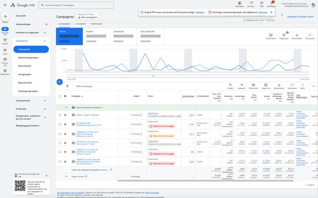

Het dashboard toont:

- **Lijndiagram** — prestaties over tijd (klikken, impressies, kosten)
- **Campagnetabel** — alle campagnes met status en statistieken
- **Linker navigatie** — toegang tot campagnes, advertenties, zoekwoorden en meer

## Campagnes bekijken

### Campagneoverzicht

Klik op **"Campagnes"** in het linkermenu om alle campagnes te zien.

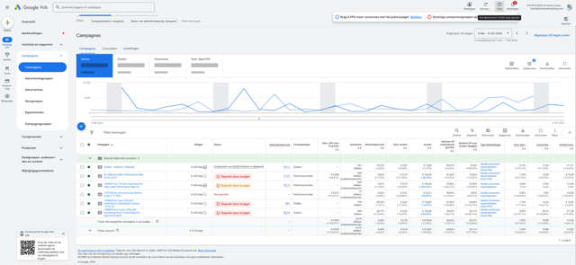

Elke campagne toont:

| Kolom | Betekenis |
|-------|-----------|
| **Status** | Actief (groen) of gepauzeerd (grijs) |
| **Impressies** | Hoe vaak de advertentie is getoond |
| **Klikken** | Hoeveel keer er is geklikt |
| **CTR** | Click-through rate (klikken ÷ impressies) |
| **Gem. CPC** | Gemiddelde kosten per klik |
| **Kosten** | Totale uitgaven |
| **Conversies** | Aantal conversies (leads, aanvragen) |

### Advertenties bekijken

Klik op **"Advertenties"** om de individuele advertenties te bekijken.

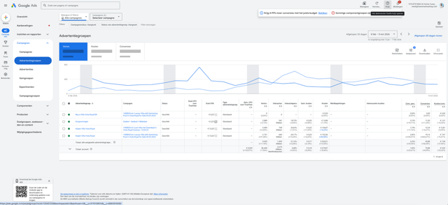

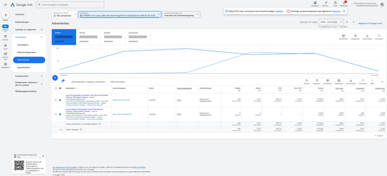

## Prestaties analyseren

### Kernstatistieken

Bovenaan het dashboard zie je de belangrijkste cijfers in blauwe vakken.

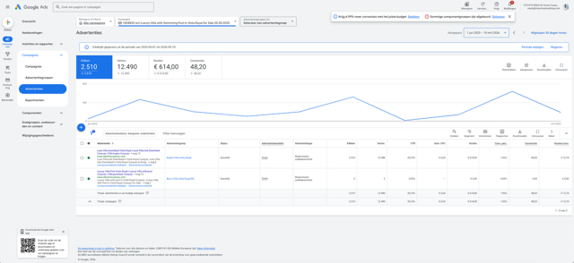

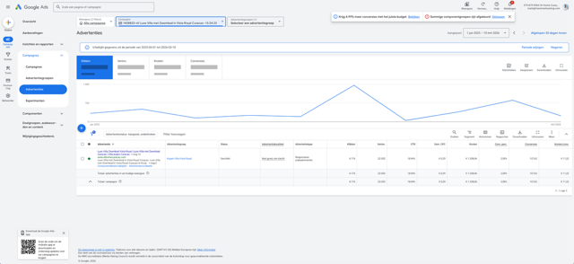

De kernstatistieken zijn:

- **Klikken** — totaal aantal klikken
- **Impressies** — totaal aantal vertoningen
- **Kosten** — totale advertentiekosten
- **Conversies** — totaal aantal leads/aanvragen

### Campagneprestaties met grafiek

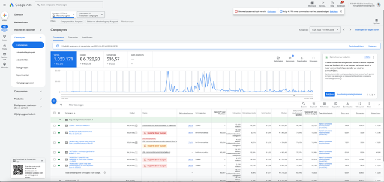

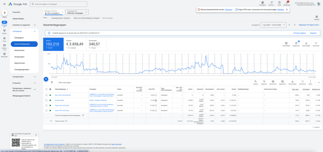

De kolomgrafiek toont dagelijkse prestaties. Gebruik de datumkiezer rechtsboven om de periode aan te passen.

### Gedetailleerde advertentieprestaties

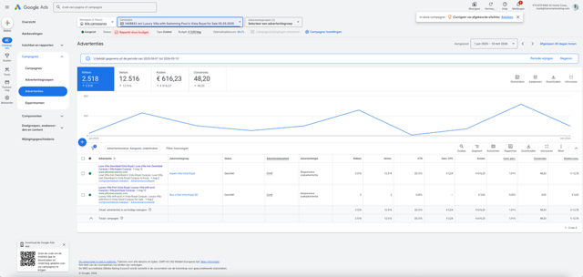

## Aanbevelingen

Google Ads geeft automatische aanbevelingen om campagnes te verbeteren.

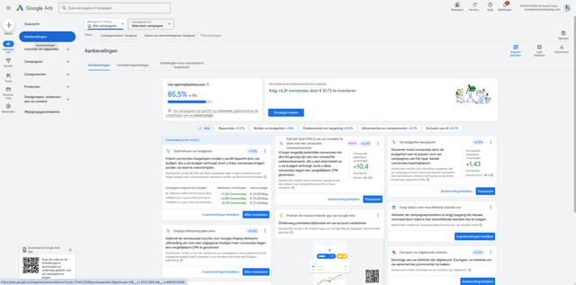

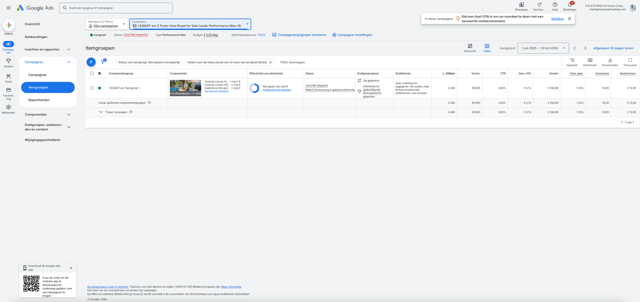

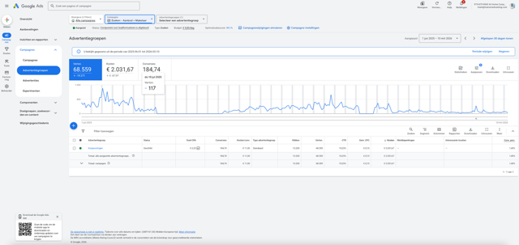

Per aanbeveling kun je:

1. De details bekijken
2. Op **"Toepassen"** klikken om de aanbeveling toe te passen
3. Of op **"Negeren"** klikken als je het niet wilt

!!! warning "Let op"
    Pas aanbevelingen niet zomaar toe. Overleg eerst met de beheerder als je twijfelt.

## Advertentie- en productweergave

### Advertentielijst

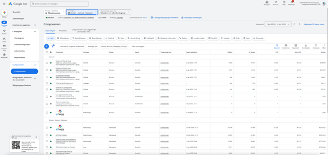

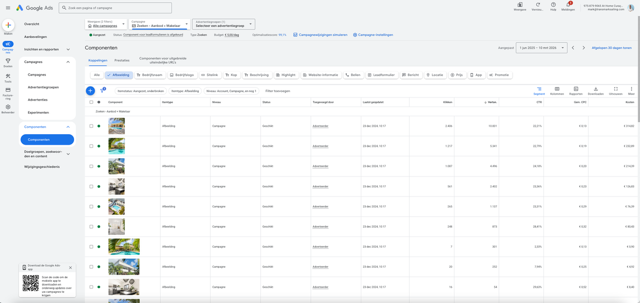

### Campagnes filteren en selecteren

Je kunt campagnes selecteren met de checkboxes voor bulk-acties.

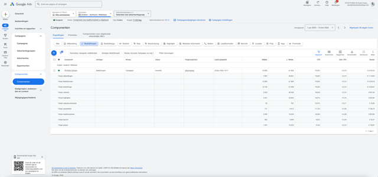

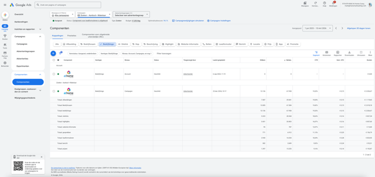

### Kolommen aanpassen

Klik op **"Kolommen"** in de toolbar om te kiezen welke statistieken je wilt zien.

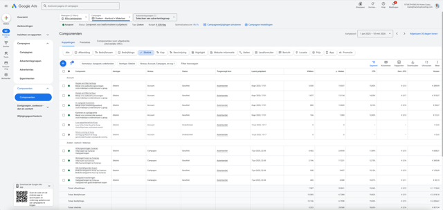

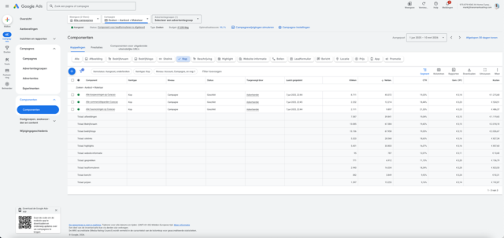

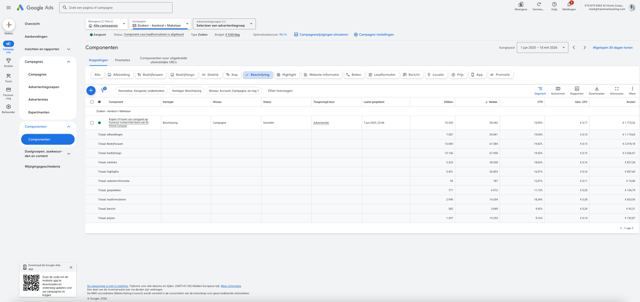

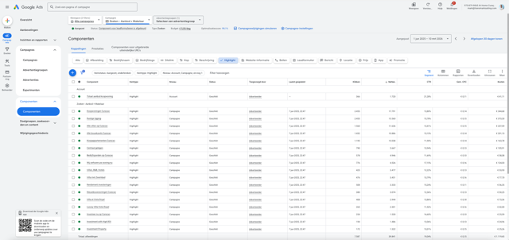

### Sorteren en labels

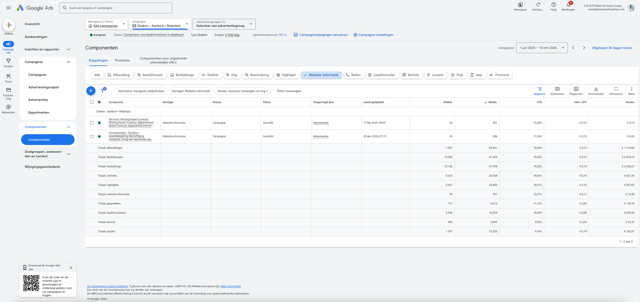

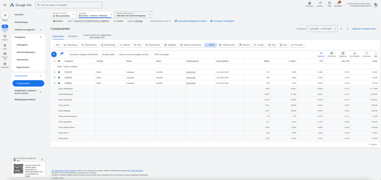

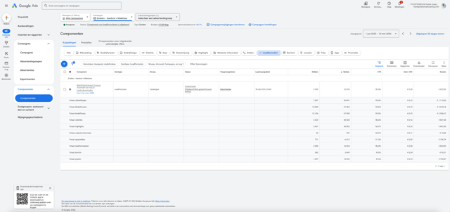

## Inzichten en diagnostiek

Klik op **"Inzichten"** voor automatische analyse van je campagneprestaties.

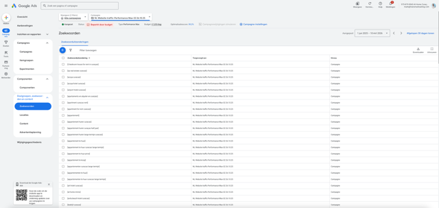

## Facturatie en budget

### Overzicht

Ga naar **"Facturatie"** in het linkermenu om kosten en budgetten te bekijken.

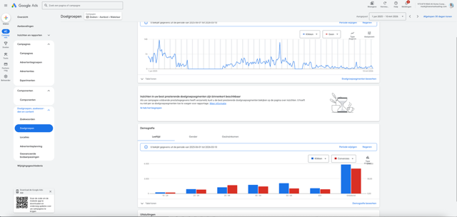

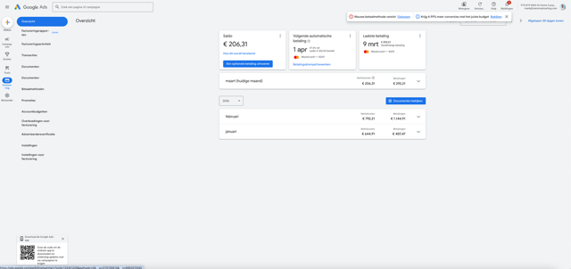

### Transactiegeschiedenis

Bekijk alle betalingen en ontvangsten.

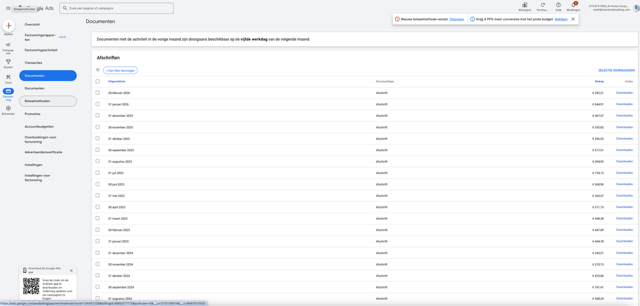

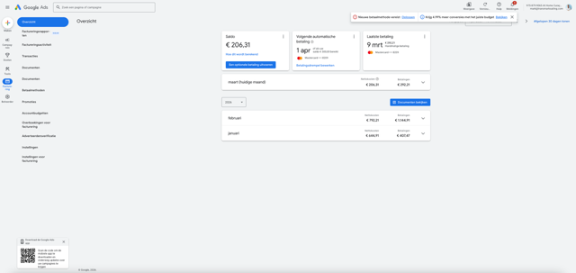

## Tips

!!! tip "Dagelijkse controle"
    Controleer minstens wekelijks de campagneprestaties om te zien of budgetten goed worden besteed.

!!! tip "Zoekwoorden"
    Bekijk regelmatig de zoekwoordrapportage om te zien welke zoektermen bezoekers gebruiken. Voeg irrelevante termen toe als **uitsluitingszoekwoorden**.
