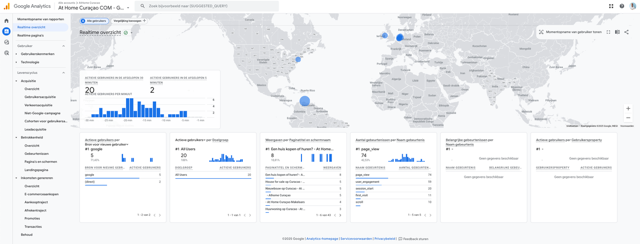
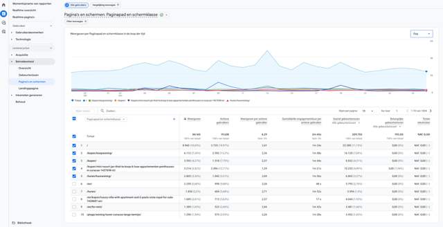
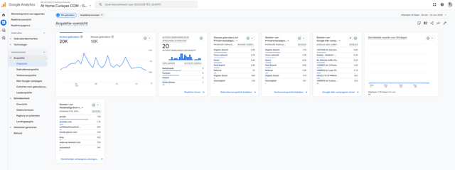
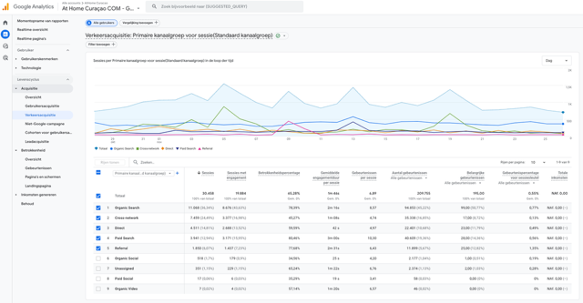
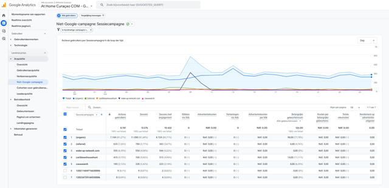
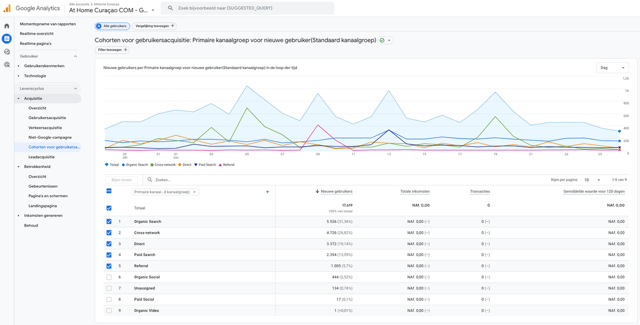
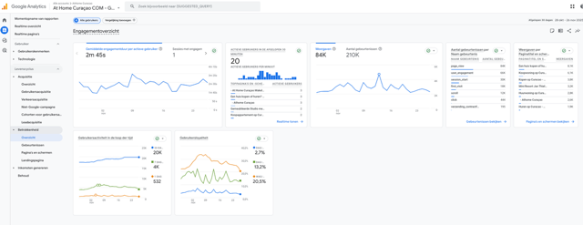
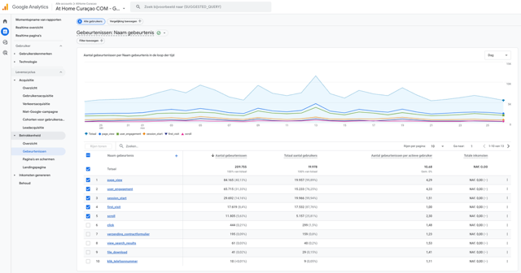
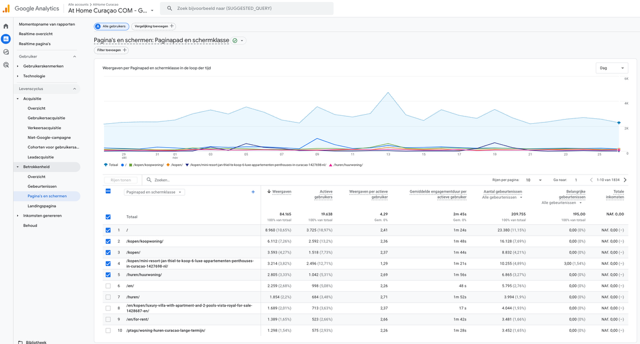
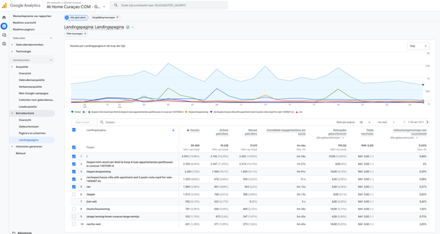

# Google Analytics

At Home Curaçao gebruikt Google Analytics om het bezoekersverkeer op de website te analyseren. Hier leer je hoe je de belangrijkste rapporten kunt bekijken en interpreteren.

!!! info "Toegang"
    Je hebt een Google-account nodig met toegang tot het At Home Curaçao Google Analytics-account. Vraag de beheerder om toegang.

**Accountnummer:** `975-879-9065`

## Inloggen

1. Ga naar [analytics.google.com](https://analytics.google.com)
2. Log in met je Google-account
3. Selecteer de **At Home Curaçao** property (975-879-9065)

## Dashboard overzicht

Na het inloggen zie je het hoofddashboard met een samenvatting van het websiteverkeer.

Het dashboard toont:

- **Wereldkaart** — waar bezoekers vandaan komen
- **Kernstatistieken** — gebruikers, sessies, paginaweergaven
- **Grafieken** — trends over de geselecteerde periode

## Pagina's en paginaweergaven

Bekijk welke pagina's het meest worden bezocht.

Dit rapport toont per pagina:

| Kolom | Betekenis |
|-------|-----------|
| **Pagina-URL** | Het adres van de pagina |
| **Paginaweergaven** | Hoe vaak de pagina is bekeken |
| **Sessies** | Aantal unieke bezoeken |
| **Engagement rate** | Percentage actieve bezoekers |
| **Gem. sessieduur** | Hoe lang bezoekers blijven |

!!! tip "Gebruik"
    Check welke listings het meest worden bekeken. Populaire listings kun je extra promoten of als **Tip** markeren op de website.

## Acquisitie — Waar komen bezoekers vandaan?

### Kanaaloverzicht

Dit rapport laat zien via welke kanalen bezoekers de website vinden:

| Kanaal | Betekenis |
|--------|-----------|
| **Organic Search** | Via Google zoekresultaten (gratis) |
| **Direct** | Direct de URL ingetypt |
| **Referral** | Via een link op een andere website |
| **Social** | Via social media (Facebook, Instagram, etc.) |
| **Paid Search** | Via Google Ads (betaald) |

### Kanaaldetails

Klik op een kanaal om de details te zien, zoals welke zoektermen of websites het meeste verkeer opleveren.

## Campagnes

Bekijk de prestaties van marketing campagnes.

Dit rapport toont per campagne het aantal sessies, paginaweergaven, engagement rate en conversies.

## Gebruikersanalyse

### Cohortanalyse

De cohortanalyse laat zien hoe groepen bezoekers zich over tijd gedragen:

- Komen bezoekers terug?
- Welke kanalen leveren de trouwste bezoekers?

### Engagement

Het engagement-rapport toont:

- **Totaal gebruikers** — unieke bezoekers
- **Gemiddelde sessieduur** — hoe lang men op de site blijft
- **Engagement rate** — percentage actief betrokken bezoekers
- **Patronen** — wanneer bezoekers het meest actief zijn

## Doelen en conversies

Conversies zijn de belangrijkste acties die bezoekers uitvoeren:

- **Brochure aanvragen**
- **Contactformulier invullen**
- **Bel-knop klikken**
- **WhatsApp bericht sturen**

## Gedetailleerde paginaprestaties

Bekijk per pagina de uitgebreide statistieken met sessies, engagement rate en bounce rate.

## Landingspagina's

Het landingspagina-rapport laat zien op welke pagina bezoekers de website betreden. Dit is belangrijk voor:

- **SEO-optimalisatie** — welke pagina's goed scoren in Google
- **Google Ads** — welke landingspagina's het beste converteren
- **Content strategie** — waar moeten we meer aandacht aan besteden

## Tips

!!! tip "Periode instellen"
    Gebruik de datumkiezer rechtsboven om de gewenste periode te selecteren. Vergelijk periodes om trends te zien.

!!! tip "Wekelijkse check"
    Controleer wekelijks de kernstatistieken: hoeveel bezoekers, welke pagina's populair, en hoeveel aanvragen binnenkomen.

!!! tip "Combineer met Google Ads"
    Vergelijk de Google Analytics-gegevens met de Google Ads-resultaten om te zien welke advertenties het beste presteren.
