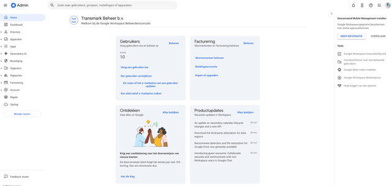
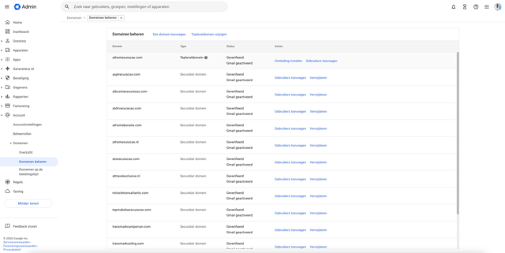
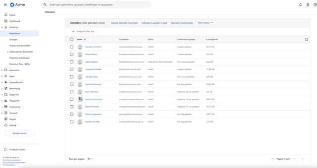
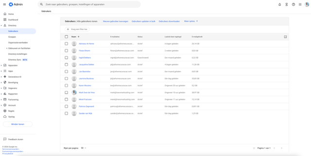
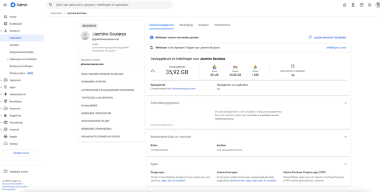
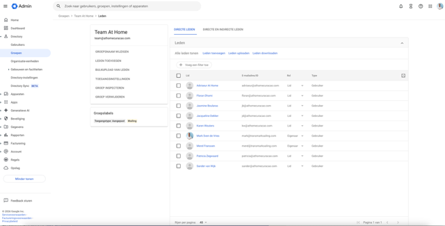
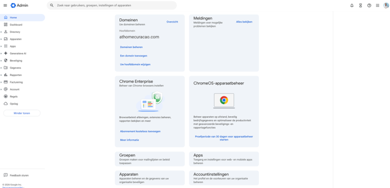

# Google Workspace

At Home Curaçao gebruikt Google Workspace (voorheen G Suite) voor e-mail, agenda, Drive en meer. Het domein is **athomecuracao.com** en wordt beheerd via de Google Admin Console door **Transmark Beheer b.v.**

!!! info "Toegang"
    Je hebt **beheerderrechten** nodig om gebruikers te beheren. Ga naar [admin.google.com](https://admin.google.com) en log in met je beheerdersaccount.

**Huidige abonnement:** Google Workspace — 10 gebruikers, $17 per account/maand

---

## Admin Console overzicht

Na het inloggen op [admin.google.com](https://admin.google.com) zie je het beheerdashboard:

Vanaf het dashboard kun je:

- **Gebruikers** beheren (toevoegen, verwijderen, opschorten)
- **Groepen** beheren (Team At Home)
- **Domeinen** beheren (athomecuracao.com + secundaire domeinen)
- **Facturering** en abonnementen bekijken
- **Beveiliging** instellingen aanpassen (2FA)

### Domeinen overzicht

At Home Curaçao heeft meerdere domeinen gekoppeld aan Google Workspace:

Het hoofddomein is **athomecuracao.com**. De overige domeinen zijn secundaire domeinen die ook voor e-mail gebruikt kunnen worden.

---

## Gebruikers beheren

### Gebruikersoverzicht

Ga naar **Directory** > **Gebruikers** om alle gebruikers te zien:

Je ziet per gebruiker: naam, e-mailadres, status, laatste login en opslaggebruik.

---

### Nieuwe gebruiker aanmaken

1. Ga naar **Directory** > **Gebruikers**
2. Klik op **"Nieuwe gebruiker toevoegen"** bovenaan
3. Vul de gegevens in:
    - **Voornaam** en **Achternaam**
    - **Primair e-mailadres** (bijv. `voornaam@athomecuracao.com`)
    - **Organisatie-eenheid** (standaard)
4. Stel een **tijdelijk wachtwoord** in
5. Klik op **"Nieuwe gebruiker toevoegen"**
6. Deel het tijdelijke wachtwoord met de nieuwe medewerker

!!! tip "Na aanmaken"
    Voeg de nieuwe gebruiker direct toe aan de **groep Team At Home** (zie verderop) en stel **2FA** in.

---

### Gebruiker verwijderen en data overzetten

Wanneer een medewerker vertrekt, moet de data worden overgezet voordat het account wordt verwijderd.

1. Ga naar **Directory** > **Gebruikers**
2. Klik op de gebruiker die verwijderd moet worden
3. Klik links op **"GEBRUIKER VERWIJDEREN"**
4. Google vraagt of je de data wilt overzetten:
    - Kies **"Ja, data overzetten"**
    - Zet de data over naar **adviseur@athomecuracao.com** (of een ander account)
    - Dit betreft: e-mails, Drive-bestanden, agenda-items
5. Bevestig de verwijdering

!!! warning "Belangrijk"
    Zet **altijd** de data over naar `adviseur@athomecuracao.com` voordat je een account verwijdert. Na verwijdering is de data niet meer terug te halen.

!!! info "Beschikbare acties"
    Op de gebruikerspagina (links) zie je alle beschikbare acties:

    - Wachtwoord opnieuw instellen
    - Alternatieve e-mailadressen toevoegen
    - Toevoegen aan groepen
    - E-mailadressen beheren
    - Gebruiker opschorten
    - Gegevens herstellen
    - Gebruiker verwijderen
    - Organisatie-eenheid wijzigen

---

### Gebruiker opschorten

Een opgeschort account kan niet meer inloggen, maar de data blijft bewaard. Gebruik dit als tijdelijke maatregel.

1. Ga naar **Directory** > **Gebruikers**
2. Klik op de gebruiker
3. Klik links op **"GEBRUIKER OPSCHORTEN"**
4. Bevestig de opschorting

De gebruiker kan niet meer inloggen en ontvangt geen e-mails meer. De data (e-mail, Drive, agenda) blijft bewaard.

**Opschorting opheffen:**

1. Ga naar de gebruiker
2. Klik op **"Opschorting opheffen"**
3. De gebruiker kan weer inloggen

!!! tip "Wanneer opschorten?"
    - Medewerker is tijdelijk afwezig (langdurig verlof)
    - Account moet onderzocht worden
    - Je wilt het account bewaren maar tijdelijk blokkeren

---

### Secundair e-mailadres aanmaken

Een secundair (alias) e-mailadres laat een gebruiker e-mails ontvangen op meerdere adressen.

1. Ga naar **Directory** > **Gebruikers**
2. Klik op de gebruiker
3. Klik links op **"ALTERNATIEVE E-MAILADRESSEN TOEVOEGEN"**
4. Vul het gewenste alias-adres in (bijv. `info@athomecuracao.com`)
5. Klik op **"Opslaan"**

De gebruiker ontvangt nu e-mails op zowel het primaire als het secundaire adres.

---

## Groepen beheren

### Team At Home groep

De groep **Team At Home** (`team@athomecuracao.com`) wordt gebruikt om alle medewerkers tegelijk te bereiken.

### Gebruiker toevoegen aan groep

1. Ga naar **Directory** > **Groepen**
2. Klik op **"Team At Home"**
3. Klik op **"Leden toevoegen"**
4. Zoek de gebruiker op naam of e-mailadres
5. Selecteer de gebruiker en klik op **"Toevoegen"**
6. Kies het type: **Lid** (standaard) of **Eigenaar**

### Gebruiker verwijderen uit groep

1. Ga naar **Directory** > **Groepen**
2. Klik op **"Team At Home"**
3. Vink de gebruiker aan die je wilt verwijderen
4. Klik op **"Leden verwijderen"**

---

## Beveiliging: 2FA instellen

At Home Curaçao **verplicht** tweefactorauthenticatie (2FA) voor alle gebruikers.

### 2FA afdwingen voor de organisatie

1. Ga naar **Beveiliging** > **Authenticatie** > **Verificatie in twee stappen**
2. Zet **"Gebruikers toestaan om verificatie in twee stappen in te schakelen"** aan
3. Zet **"Afdwingen"** aan — alle gebruikers moeten 2FA instellen
4. Stel een **deadline** in waarbinnen gebruikers 2FA moeten activeren

### 2FA instellen per gebruiker

Elke medewerker moet zelf 2FA instellen:

1. Ga naar [myaccount.google.com/security](https://myaccount.google.com/security)
2. Klik op **"Verificatie in twee stappen"**
3. Klik op **"Aan de slag"**
4. Kies de methode:
    - **Google Authenticator app** (aanbevolen)
    - SMS-verificatie
    - Beveiligingssleutel
5. Scan de QR-code met de Google Authenticator app
6. Vul de verificatiecode in
7. Klik op **"Inschakelen"**

### Back-up codes downloaden

Back-up codes zijn nodig als je geen toegang hebt tot je telefoon (verloren, kapot, etc.).

1. Ga naar [myaccount.google.com/security](https://myaccount.google.com/security)
2. Klik op **"Verificatie in twee stappen"**
3. Scroll naar **"Back-upcodes"**
4. Klik op **"Codes weergeven"** of **"Nieuwe codes genereren"**
5. **Download of print** de codes en bewaar ze op een veilige plek

!!! danger "Bewaar back-up codes veilig"
    Elke code is eenmalig te gebruiken. Bewaar ze op een veilige plek (niet op je telefoon). Als je alle codes hebt gebruikt, genereer dan nieuwe.

!!! warning "2FA is verplicht"
    At Home Curaçao dwingt 2FA af voor alle accounts. Zonder 2FA kun je na de deadline niet meer inloggen. Stel dit zo snel mogelijk in na het aanmaken van je account.

---

## Overzicht Admin Console

| Onderdeel | Functie |
|-----------|---------|
| **Gebruikers** | Accounts aanmaken, verwijderen, opschorten |
| **Groepen** | Team At Home beheren, leden toevoegen/verwijderen |
| **Domeinen** | athomecuracao.com en secundaire domeinen |
| **Facturering** | Abonnementen en betalingen |
| **Beveiliging** | 2FA afdwingen, beveiligingsbeleid |
| **Apps** | Google-apps en externe apps beheren |
| **Rapporten** | Gebruiksstatistieken en auditlogs |
| **Account** | Organisatie-instellingen |

---

## Samenvatting veelgebruikte taken

| Taak | Pad in Admin Console |
|------|---------------------|
| Gebruiker aanmaken | Directory > Gebruikers > Nieuwe gebruiker toevoegen |
| Gebruiker verwijderen | Directory > Gebruikers > [gebruiker] > Gebruiker verwijderen |
| Data overzetten | Bij verwijderen: data overzetten naar adviseur@athomecuracao.com |
| Gebruiker opschorten | Directory > Gebruikers > [gebruiker] > Gebruiker opschorten |
| Secundair e-mail | Directory > Gebruikers > [gebruiker] > Alternatieve e-mailadressen |
| Toevoegen aan groep | Directory > Groepen > Team At Home > Leden toevoegen |
| Verwijderen uit groep | Directory > Groepen > Team At Home > Lid aanvinken > Verwijderen |
| 2FA afdwingen | Beveiliging > Authenticatie > Verificatie in twee stappen |
| Back-up codes | myaccount.google.com/security > Verificatie in twee stappen > Back-upcodes |
