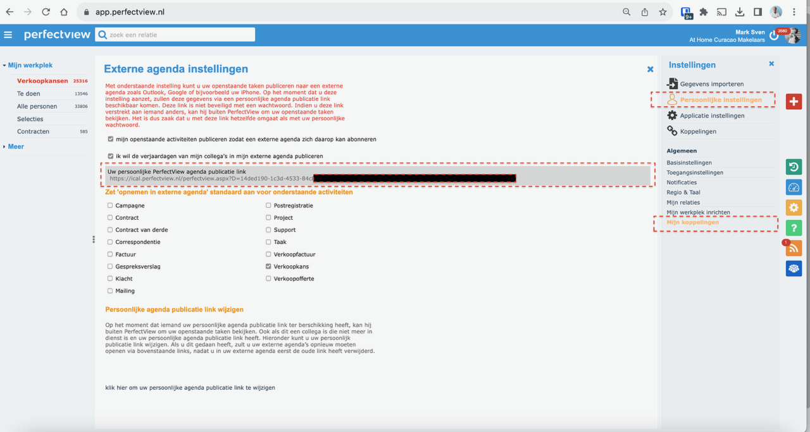
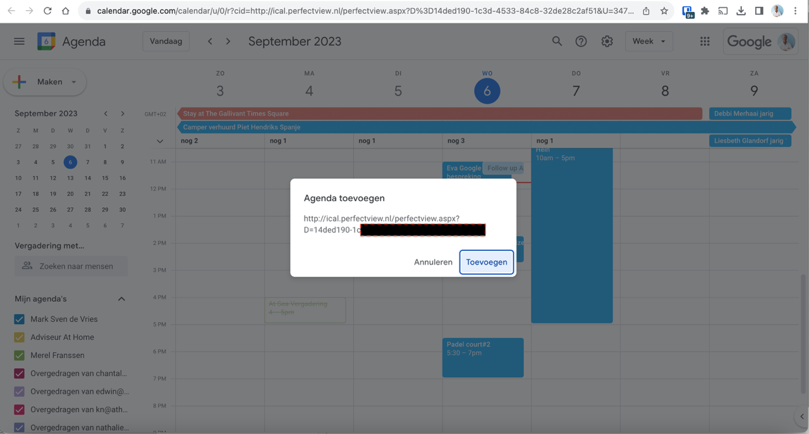
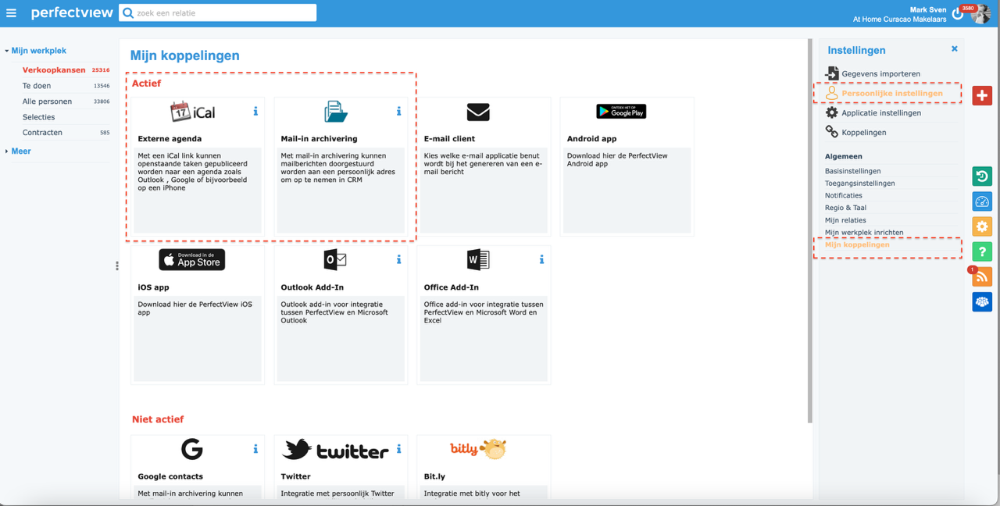
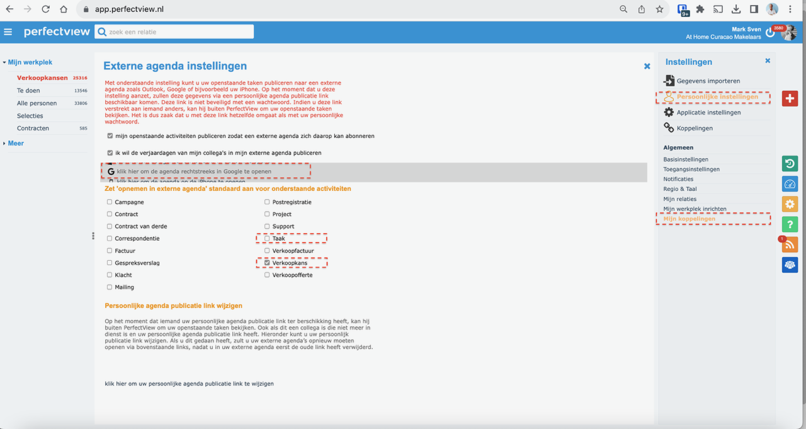
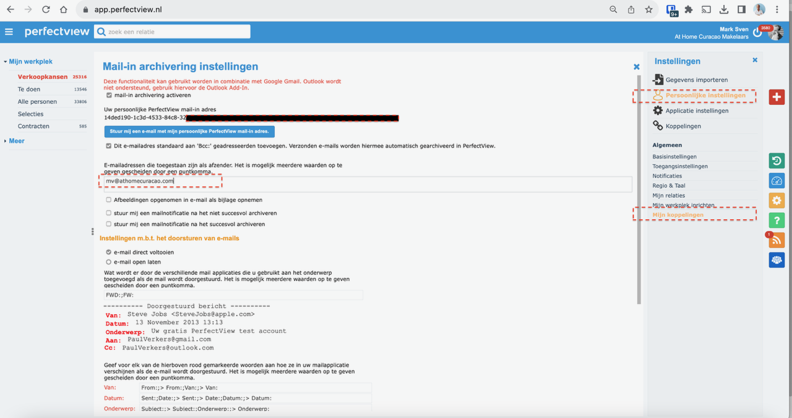

# Stap 6: Agenda & Gmail koppelen

Door je agenda en Gmail te koppelen aan Perfectview kun je afspraken en e-mails automatisch synchroniseren.

## Agenda koppelen

### Stap 1: Externe agenda instellingen openen

1. Ga naar **Instellingen** → **Externe agenda instellingen**
2. Je ziet een overzicht van beschikbare koppelingen

### Stap 2: Agenda selecteren

Selecteer welke agenda je wilt koppelen:

| Platform | Beschrijving |
|----------|-------------|
| **Outlook** | Microsoft Outlook agenda |
| **Gmail** | Google Calendar |
| **iCal** | Apple Calendar |

1. Vink het gewenste platform aan
2. Volg de instructies om toestemming te geven
3. Klik op **"Opslaan"**

### Koppelingen overzicht

Na het koppelen zie je een overzicht van alle actieve koppelingen.

## Gmail koppelen

### Stap 1: Gmail selecteren

1. Ga naar **Instellingen** → **Externe agenda instellingen**
2. Vink **"Gmail"** aan
3. Klik op **"Koppelen"**

### Stap 2: Toestemming geven

1. Je wordt doorgestuurd naar Google
2. Log in met je Google-account
3. Geef Perfectview toestemming om je agenda en e-mail te lezen
4. Je wordt teruggestuurd naar Perfectview

!!! tip "Voordelen van Gmail-koppeling"
    - E-mails worden automatisch gekoppeld aan contacten
    - Afspraken verschijnen in je Perfectview-agenda
    - Je kunt e-mails versturen vanuit Perfectview

## Na het koppelen

Na een succesvolle koppeling:

- Nieuwe afspraken verschijnen automatisch in Perfectview
- E-mailcorrespondentie wordt gekoppeld aan het juiste contact
- Je kunt vanuit Perfectview je agenda beheren

## Volgende stap

Ga naar [Stap 7: Collega attenderen](collega-attenderen.md) om te leren hoe je collega's op de hoogte brengt.
