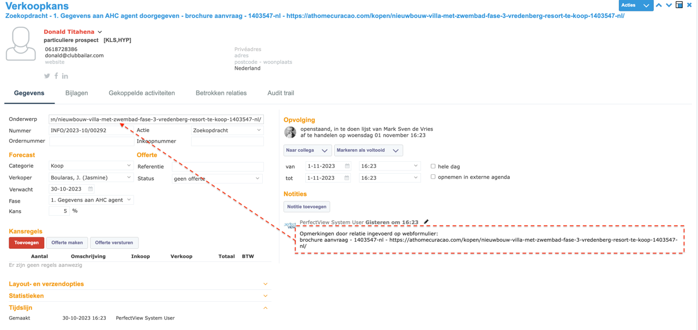

# Stap 8: Brochure aanvraag

Wanneer een prospect een brochure aanvraagt, wordt dit vastgelegd als een verkoopkans in Perfectview.

## Brochure aanvraag verwerken

### Stappen

1. Een brochure-aanvraag komt binnen (via website, e-mail of telefoon)
2. **Zoek het contact** in Perfectview (of maak een nieuw contact aan)
3. Maak een **nieuwe verkoopkans** aan
4. Vul de gegevens in:

| Veld | Wat invullen |
|------|-------------|
| **Onderwerp** | "Brochure aanvraag [objectnaam]" |
| **Fase** | "1. Gegevens aan AHC agent doorgegeven" |
| **Categorie** | Koop / Huur / Vakantie |
| **Bron** | Website / Telefoon / E-mail |

5. **Attendeer de verantwoordelijke agent** (zie [Collega attenderen](collega-attenderen.md))
6. Stel een **opvolgdatum** in

## Opvolging

Na het aanmaken van de brochure-aanvraag:

1. De verantwoordelijke agent ontvangt een notificatie
2. De agent neemt contact op met de prospect
3. **Update de fase** in de verkoopkans (zie [Verkoopkansen & Fasen](verkoopkansen.md))
4. Leg het contactmoment vast als **activiteit**

!!! warning "Belangrijk"
    Elke brochure-aanvraag is een potentiële verkoop. Verwerk ze altijd dezelfde dag en zorg voor snelle opvolging.

## Volgende stap

Ga naar [Stap 9: Campagnes & Downloads](campagnes.md) voor het beheren van campagnes.
