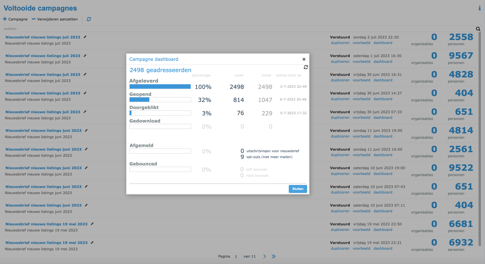

# Stap 9: Campagnes & Downloads

Hier leer je hoe je campagnes beheert en gegevens downloadt uit Perfectview.

## Uitgevoerde campagnes

Het campagne-overzicht toont alle uitgevoerde en geplande campagnes:

- **Naam** van de campagne
- **Datum** van uitvoering
- **Aantal ontvangers**
- **Resultaten** (geopend, geklikt, etc.)

## Downloads en exports

### Verkoopkansen downloaden

1. Ga naar het gewenste overzicht (contacten, verkoopkansen, etc.)
2. Pas eventueel **filters** toe
3. Klik op **"Downloaden"** of het export-icoon
4. Kies het formaat: **Excel** of **CSV**
5. Het bestand wordt gedownload

### Veelgebruikte exports

| Export | Wanneer |
|--------|---------|
| **Contactenlijst** | Maandelijks overzicht van alle contacten |
| **Verkoopkansen** | Wekelijks voor het teamoverleg |
| **Openstaande taken** | Dagelijks voor je eigen planning |
| **Campagne resultaten** | Na elke campagne |

!!! tip "Tip"
    Plan een vast moment per week om je Perfectview gegevens te exporteren en te reviewen. Zo houd je overzicht.

---

Dit is het einde van de Perfectview CRM handleiding. Bekijk ook de [Relatiecodes & Labels](relatiecodes.md) voor een compleet overzicht, of ga terug naar de [WordPress handleiding](../wordpress/index.md).
