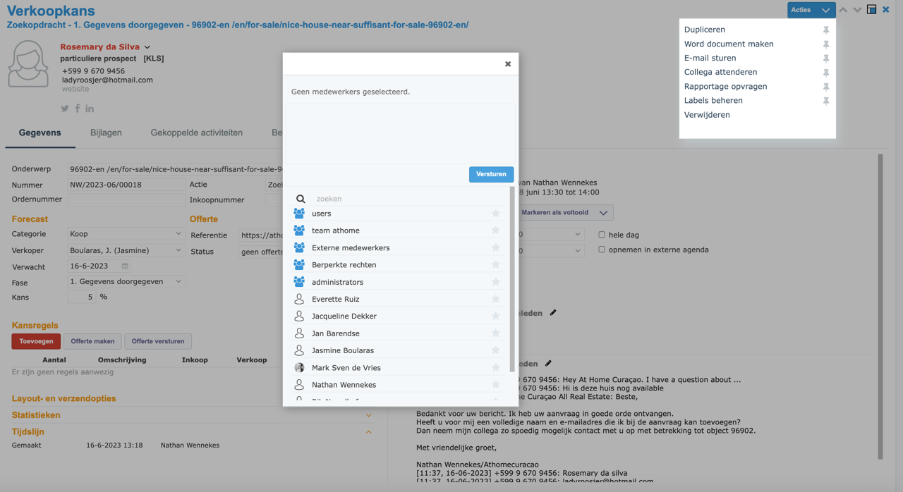

# Stap 7: Collega attenderen

In Perfectview kun je collega's op de hoogte brengen van belangrijke zaken bij een contact of verkoopkans.

## Een collega attenderen

### Stappen

1. Open het contact of de verkoopkans
2. Klik op **"Collega attenderen"** of het notificatie-icoon
3. Een dropdown verschijnt met beschikbare collega's
4. **Selecteer de collega** die je wilt attenderen
5. Typ eventueel een **bericht** erbij
6. Klik op **"Versturen"**

### Beschikbare collega's

In de lijst zie je alle Perfectview-gebruikers van At Home Curaçao. Selecteer de juiste persoon.

## Wanneer een collega attenderen?

| Situatie | Actie |
|----------|-------|
| **Nieuwe lead voor collega** | Attendeer de verantwoordelijke agent |
| **Belangrijke update** | Attendeer betrokken collega's |
| **Overdracht listing** | Attendeer de nieuwe listinghouder |
| **Urgente zaak** | Attendeer directie + betrokken agent |

!!! tip "Tip"
    Combineer het attenderen in Perfectview altijd met een **e-mail** voor urgente zaken. Niet iedereen checkt PV continu.

## Volgende stap

Ga naar [Stap 8: Brochure aanvraag](brochure-aanvraag.md) voor het verwerken van brochure-aanvragen.
