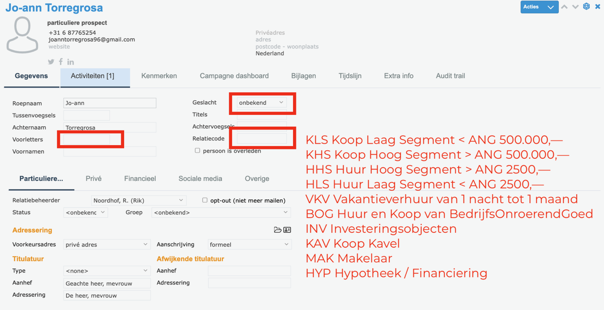
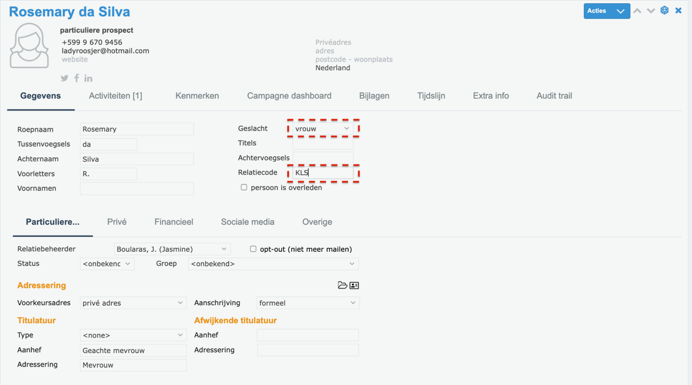
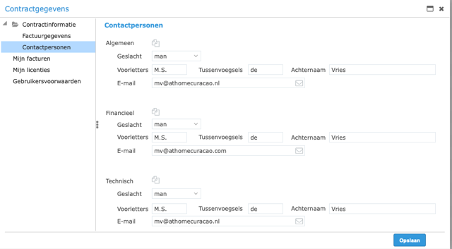
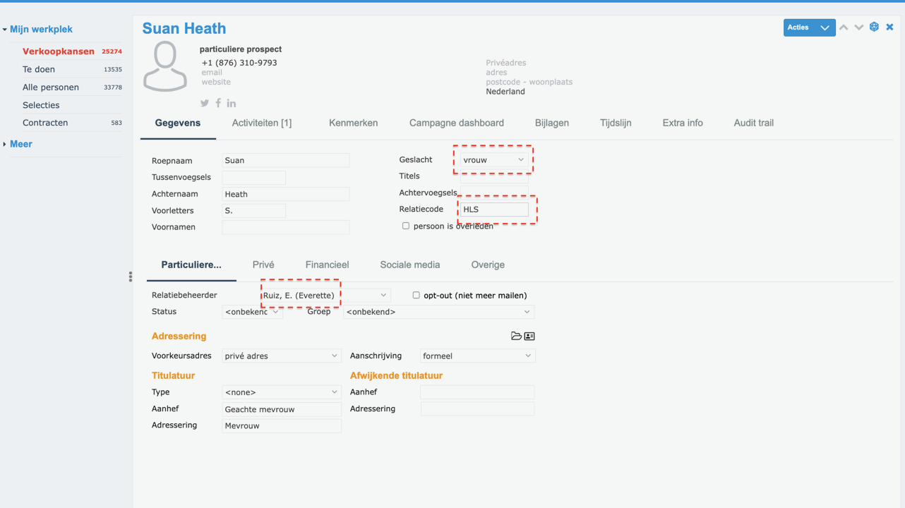
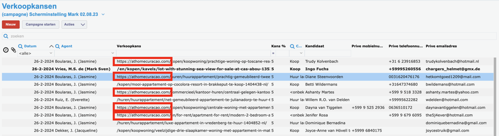

# Stap 3: Contactgegevens invullen

Hier leer je hoe je contactpersonen aanmaakt en hun gegevens volledig invult in Perfectview.

## Contactpersoon openen

1. Zoek de contactpersoon via de zoekbalk, of
2. Maak een nieuw contact aan via **"Nieuw"** → **"Persoon"**

## Gegevens invullen

Vul de volgende velden in:

| Veld | Wat invullen |
|------|-------------|
| **Titel** | Dhr. / Mw. / etc. |
| **Voornaam** | Voornaam van de contactpersoon |
| **Achternaam** | Achternaam |
| **Telefoon** | Telefoonnummer (met landcode) |
| **E-mail** | E-mailadres |
| **Adres** | Woon- of kantooradres |

### Relatiecodes toewijzen

Wijs de juiste relatiecodes toe aan het contact (zie [Relatiecodes & Labels](relatiecodes.md)):

- **KLS** — Koop Laag Segment
- **KHS** — Koop Hoog Segment
- **HHS** / **HLS** — Huur Hoog/Laag Segment
- **BOG** — Bedrijfsonroerend goed
- **VKV** — Vakantieverhuur
- **INV** — Investeringspanden
- **MAK** — Makelaar
- **HYP** — Hypotheek

## Volledig invullen

!!! warning "Belangrijk"
    Vul contacten altijd zo **volledig mogelijk** in. Onvolledige gegevens zijn moeilijk terug te vinden en leiden tot dubbele contacten.

Zorg dat je minimaal invult:

1. **Naam** (voor- en achternaam)
2. **E-mailadres**
3. **Telefoonnummer**
4. **Relatiecodes** (type klant)
5. **Bron** (hoe het contact is binnengekomen)

## Contactpersonen overzicht

Het contactpersonen-overzicht toont alle contacten in een tabelweergave met hun belangrijkste gegevens.

## PV volledig invullen

Zorg ervoor dat alle velden in de contactkaart zijn ingevuld. Onvolledige records maken het moeilijk om later informatie terug te vinden.

## Verwijderen URL voor betere leesbaarheid

Verwijder lange URL's uit tekstvelden voor een betere leesbaarheid van de contactkaart.

## Volgende stap

Ga naar [Stap 4: Verkoopkansen & Fasen](verkoopkansen.md) om te leren over het bijhouden van verkoopkansen.
