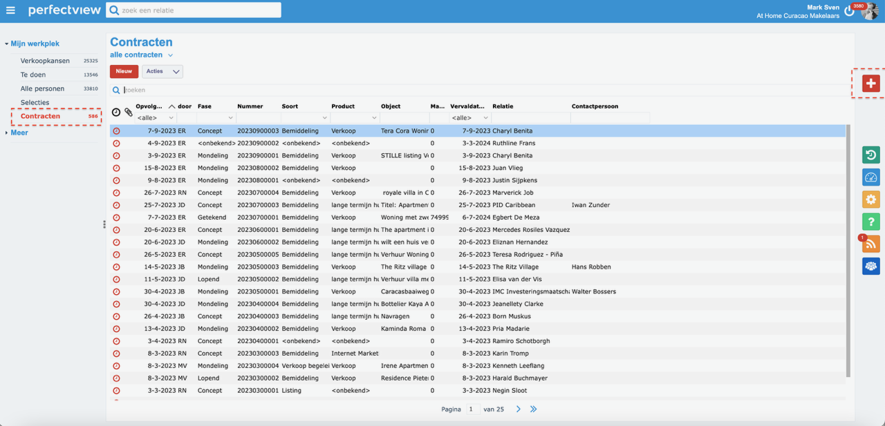
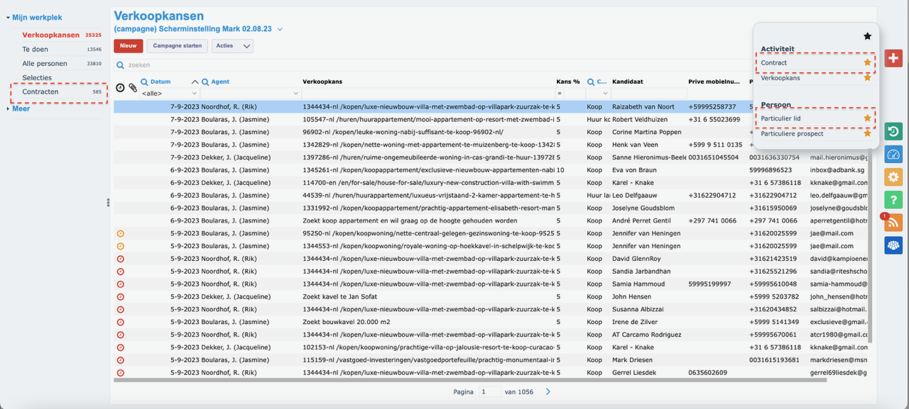
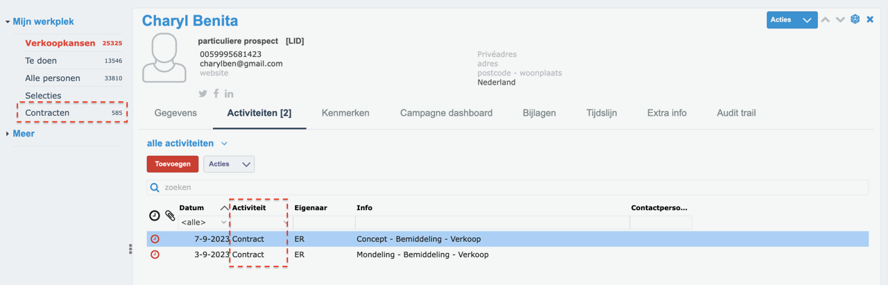

# Stap 5: Contracten

Hier leer je hoe je contracten beheert in Perfectview.

## Contracten overzicht

Het contractenoverzicht toont alle lopende en afgeronde contracten in een tabelweergave.

## Contractgegevens bekijken

Elk contract bevat:

| Veld | Beschrijving |
|------|-------------|
| **Contractnummer** | Uniek nummer |
| **Contactpersoon** | Gekoppelde klant/eigenaar |
| **Type** | OTO, huurcontract, etc. |
| **Status** | Actief, verlopen, opgezegd |
| **Startdatum** | Ingangsdatum |
| **Einddatum** | Vervaldatum |

## Verkoopkansen koppelen aan contracten

Wanneer een verkoopkans resulteert in een deal, koppel je deze aan een contract:

1. Open de verkoopkans
2. Ga naar het tabblad **"Contracten"**
3. Koppel het bestaande contract of maak een nieuw contract aan

## Volgende stap

Ga naar [Stap 6: Agenda & Gmail koppelen](agenda-gmail.md) voor het integreren van je agenda en e-mail.
