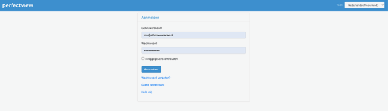

# Stap 1: Inloggen op Perfectview

## Ga naar Perfectview

Open je webbrowser en ga naar:

```
https://www.perfectview.nl
```

Klik op **"Inloggen"** rechtsboven op de pagina.

## Vul je gegevens in



1. **Gebruikersnaam** — Vul je gebruikersnaam of e-mailadres in
2. **Wachtwoord** — Vul je wachtwoord in
3. Vink eventueel **"Onthouden"** aan
4. Klik op **"Inloggen"**

## Na het inloggen

Je komt nu op je Perfectview werkplek terecht. Als dit je eerste keer is, ga naar [Stap 2: Werkplek inrichten](werkplek.md) om je werkplek te configureren.

!!! danger "Wachtwoord vergeten?"
    Klik op "Wachtwoord vergeten?" op het inlogscherm, of neem contact op met je leidinggevende.

## Volgende stap

Ga naar [Stap 2: Werkplek inrichten](werkplek.md) om je persoonlijke werkplek te configureren.
