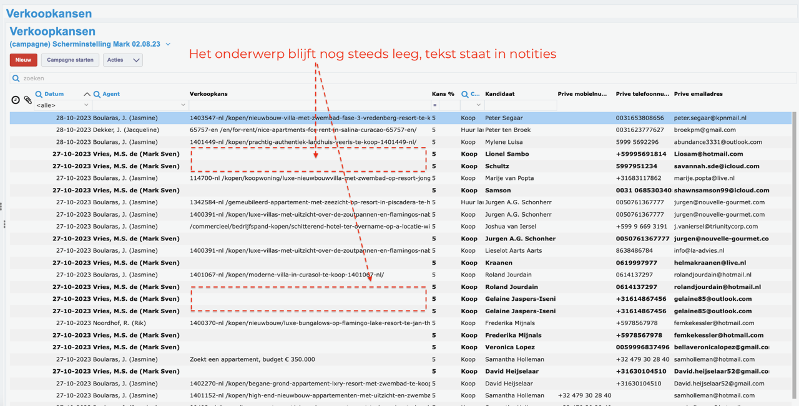
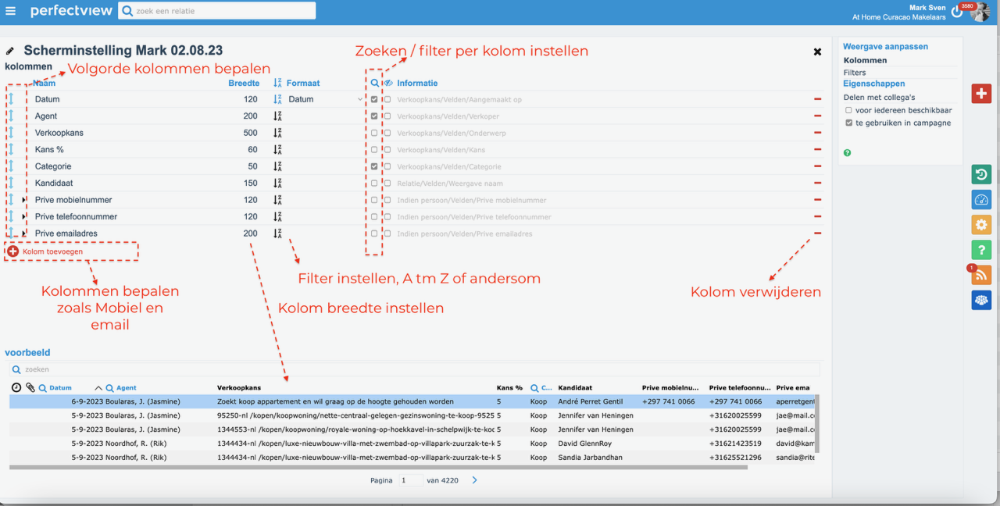
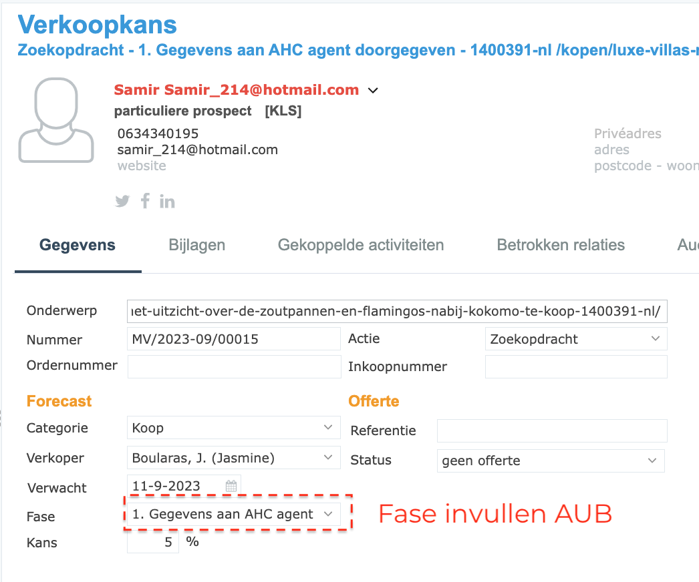
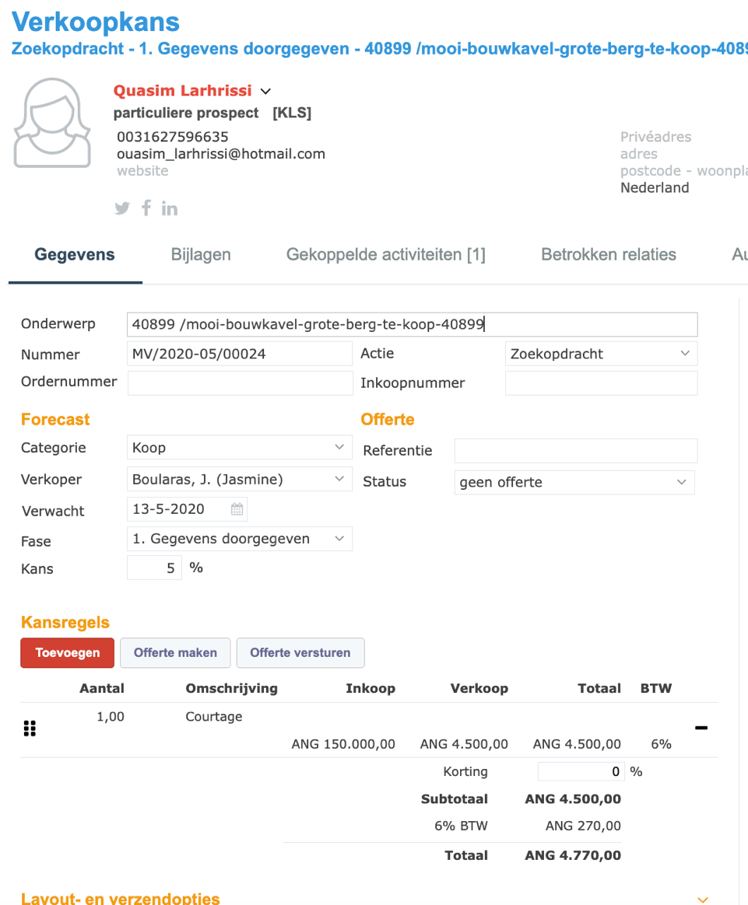
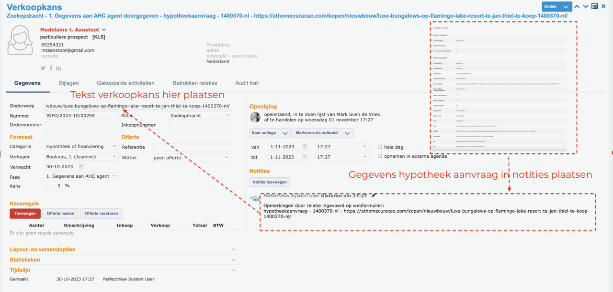
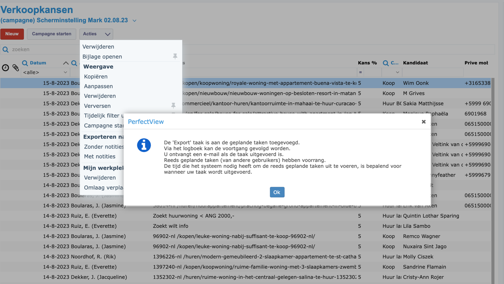

# Stap 4: Verkoopkansen & Fasen

Verkoopkansen zijn het hart van het CRM. Hier leg je vast welke klanten geïnteresseerd zijn in welke panden en in welke fase het verkoopproces zich bevindt.

## Verkoopkansen overzicht

Het overzicht toont alle lopende verkoopkansen met:

- Contactpersoon
- Object/listing
- Huidige fase
- Verwachte sluiting
- Kanspercentage

## Verkoopkansen inrichten

Configureer de verkoopkansen-pipeline met de juiste fasen en categorieën voor At Home Curaçao.

## Fase invullen

Bij elke verkoopkans moet de **fase** worden ingevuld en bijgehouden:

### Velden invullen

| Veld | Wat invullen |
|------|-------------|
| **Onderwerp** | Omschrijving van de verkoopkans |
| **Nummer** | Automatisch gegenereerd |
| **Categorie** | Koop / Huur / Vakantie etc. |
| **Verkoper** | Naam van de verantwoordelijke agent |
| **Verwacht** | Verwachte sluitingsdatum |
| **Fase** | Huidige fase (zie hieronder) |
| **Kans** | Geschat percentage (5% - 100%) |

### Fasen

Werk de fase bij naarmate het verkoopproces vordert:

1. **Gegevens aan AHC agent doorgegeven** (5%)
2. Bezichtiging gepland
3. Bezichtiging uitgevoerd
4. Onderhandeling
5. Optie genomen
6. Contract getekend
7. Afgerond / Verkocht

!!! danger "Fase invullen AUB"
    Vul de fase **altijd** in en houd deze up-to-date. Een verkoopkans zonder fase is onbruikbaar voor de rapportage.

## Aanvraag verwerken

### Nieuwe aanvraag

Bij een nieuwe aanvraag:

1. Maak een nieuwe **verkoopkans** aan
2. Koppel het contact aan de verkoopkans
3. Vul de **fase** in (fase 1)
4. Stel een **opvolgdatum** in

### Hypotheek aanvraag

Bij hypotheek-gerelateerde zaken wordt dit apart bijgehouden met de relevante gegevens.

## Download verkoopkansen

Je kunt verkoopkansen exporteren:

1. Ga naar het verkoopkansen-overzicht
2. Klik op **"Downloaden"** of het export-icoon
3. Kies het gewenste formaat (Excel/CSV)

## Volgende stap

Ga naar [Stap 5: Contracten](contracten.md) om te leren over contractbeheer.
