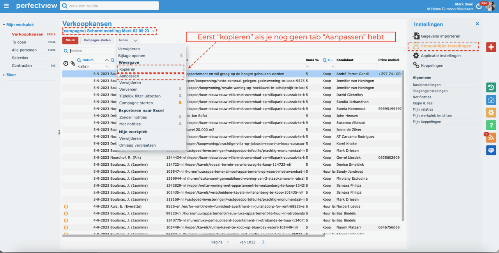
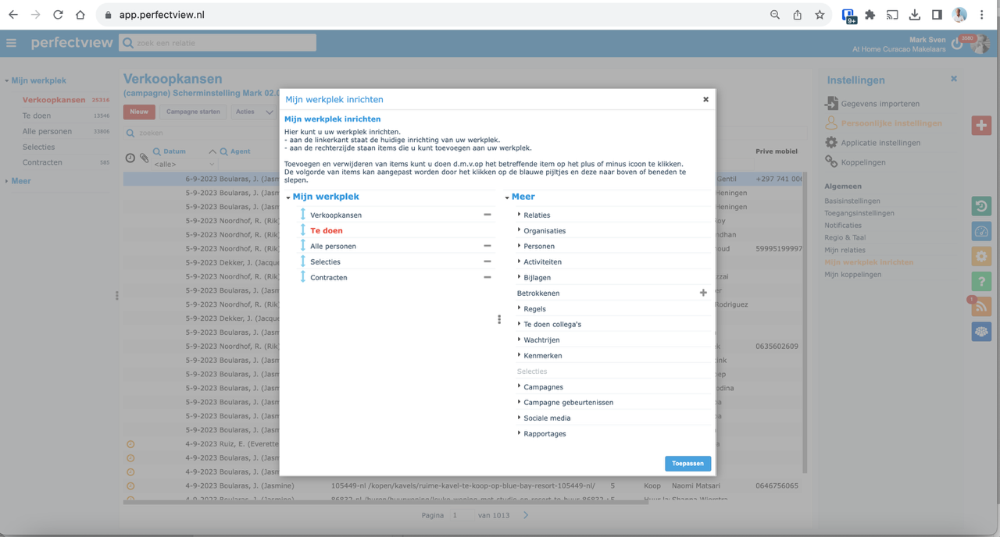
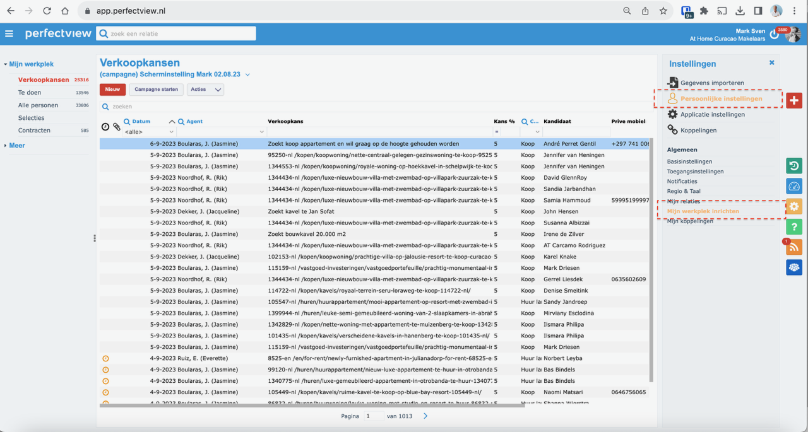

# Stap 2: Werkplek inrichten

Bij het eerste gebruik van Perfectview moet je je persoonlijke werkplek inrichten. Dit bepaalt welke onderdelen je ziet op je startscherm.

## Werkplek configuratie starten

Na het inloggen kun je je werkplek inrichten door de gewenste onderdelen te selecteren.

## Stap 1: Onderdelen kiezen

Kies welke onderdelen je op je werkplek wilt zien:

| Onderdeel | Beschrijving |
|-----------|-------------|
| **Te doen** | Openstaande taken en acties |
| **Mijn afspraken** | Je geplande afspraken |
| **Contracten** | Overzicht van contracten |
| **Organisatie** | Organisatiegegevens |
| **Personen** | Contactpersonen |
| **Afspraken** | Alle afspraken |

Klik op **"Volgende"** om door te gaan.

## Stap 2: Indeling aanpassen

1. Pas de **indeling** van je werkplek aan
2. Sleep onderdelen naar de gewenste positie
3. Verwijder onderdelen die je niet nodig hebt
4. Klik op **"Opslaan"** om je werkplek te bevestigen

!!! tip "Tip"
    Je kunt je werkplek later altijd opnieuw inrichten via de instellingen.

## Volgende stap

Ga naar [Stap 3: Contactgegevens invullen](contactgegevens.md) om te leren hoe je contacten beheert.
