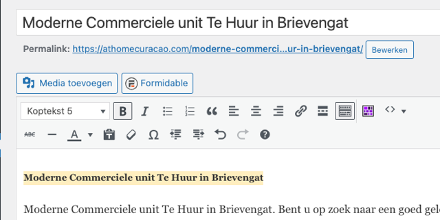
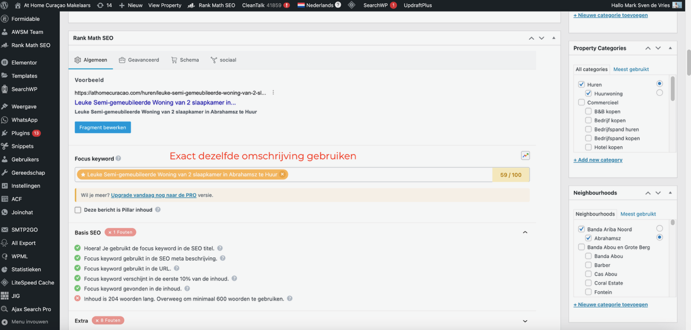
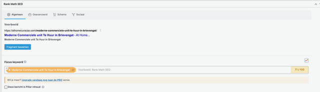
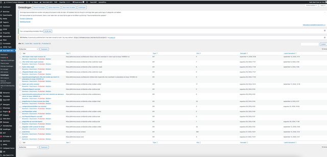

# Stap 4: Beschrijving & SEO

Hier leer je hoe je de beschrijvingstekst invult en de SEO-instellingen optimaliseert met Rank Math.

## Beschrijving invullen

### Titel als eerste regel

1. Kopieer de listing-titel als eerste regel in het beschrijvingsveld
2. Maak deze **vetgedrukt** met kopstijl **Heading 5**
3. Voeg een lege regel toe tussen de titel en de beschrijvingstekst

### Beschrijvingstekst

Voer de advertentietekst in het hoofdtekstveld in. Dit is de tekst die bezoekers te zien krijgen bij de listing.

### Beschrijving kopiëren (5x)

De beschrijving moet op **5 plekken** worden ingevuld voor optimale SEO:

1. Hoofdbeschrijvingsveld
2. Rank Math SEO beschrijving
3. Property Expert veld (kort, max 3-4 regels)
4. Meta description
5. Social media beschrijving

## Rank Math SEO instellen

Scroll naar het **Rank Math SEO** gedeelte onderaan de pagina.

### Stappen

1. Klik op het **"Algemeen"** tabblad
2. Controleer de **URL/Permalink** — deze moet kloppen
3. Vul het **Focus keyword** in (het belangrijkste zoekwoord)
4. Vul de **Meta beschrijving** in (korte samenvatting voor Google)
5. Controleer dat de SEO-score **groen** is

!!! tip "Focus keyword"
    Gebruik een zoekterm die potentiële klanten zouden gebruiken, zoals "villa kopen Curacao" of "appartement huren Jan Thiel".

### SEO Omleidingen

Bij het verwijderen of verplaatsen van een listing kun je een omleiding instellen:

### Tekstanalyse

Onderaan de pagina vind je de **Tekstanalyse** van Rank Math. Deze geeft suggesties voor verbetering:

- **Groen** = goed
- **Oranje** = kan beter
- **Rood** = moet verbeterd worden

!!! info "SEO checklist"
    Controleer voor publicatie:

    - [ ] Focus keyword ingevuld
    - [ ] Meta beschrijving ingevuld
    - [ ] SEO-score is groen
    - [ ] URL bevat het zoekwoord

## Volgende stap

Ga naar [Stap 5: Foto's & Galerij](fotos-galerij.md) voor het uploaden van afbeeldingen.
