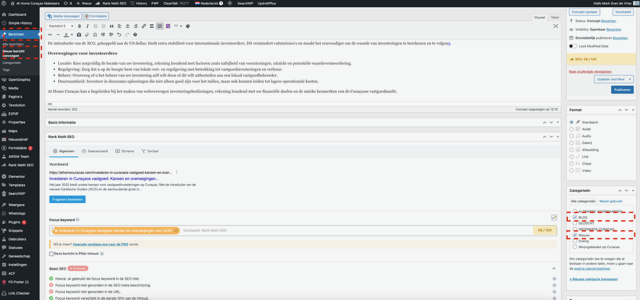
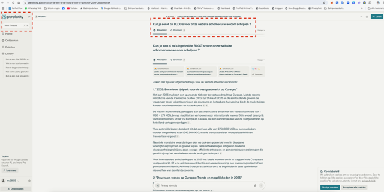
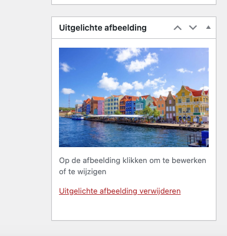
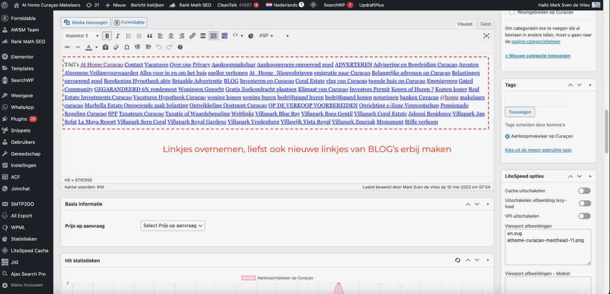
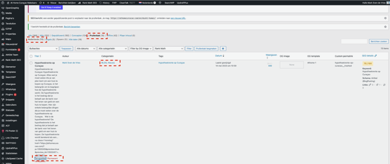

# Stap 9: Blog schrijven

Blogartikelen helpen bij de SEO van de website en trekken bezoekers aan. Hier leer je hoe je een blogartikel schrijft en publiceert.

## Nieuw blogartikel aanmaken

1. Ga in het linkermenu naar **"Berichten → Nieuw bericht"**
2. Je komt nu in de WordPress editor

## Blog schrijven

### Stappen

1. **Titel invullen** — Kies een pakkende, SEO-vriendelijke titel
2. **Tekst schrijven** — Gebruik de editor om je artikel te schrijven
3. **Opmaak toepassen**:
   - Gebruik **kopjes** (H2, H3) om structuur aan te brengen
   - Gebruik **vetgedrukt** voor belangrijke termen
   - Voeg **opsommingen** toe waar relevant
4. **Afbeeldingen toevoegen** — Klik op "+" en kies "Afbeelding"
5. **Links toevoegen** — Link naar relevante pagina's of listings

### AI-hulp bij het schrijven

Je kunt tools zoals Perplexity gebruiken voor onderzoek en inspiratie bij het schrijven van blogartikelen:

## Uitgelichte afbeelding

Elk blogartikel heeft een uitgelichte afbeelding nodig (deze verschijnt in het overzicht):

1. Klik rechts op **"Uitgelichte afbeelding"**
2. Upload een passende afbeelding of kies er een uit de mediabibliotheek
3. Klik op **"Uitgelichte afbeelding instellen"**

## Links in blogartikelen

Voeg altijd relevante links toe:

- Links naar gerelateerde listings op de website
- Links naar andere blogartikelen
- Externe links naar relevante bronnen

## Blog categorieën en tags

1. Kies de juiste **categorie** in het rechterpaneel
2. Voeg relevante **tags** toe
3. Stel de **SEO** in via Rank Math (zie [Beschrijving & SEO](beschrijving-seo.md))

## Blogs uit prullenbak terugzetten

Per ongeluk een blog verwijderd? Je kunt deze terugzetten:

1. Ga naar **"Berichten → Alle berichten"**
2. Klik op **"Prullenbak"**
3. Beweeg je muis over het artikel en klik op **"Terugzetten"**

## Publiceren

1. Klik op **"Voorbeeld"** om het artikel te controleren
2. Tevreden? Klik op **"Publiceren"**
3. Controleer het gepubliceerde artikel op de website

## Volgende stap

Ga naar [Stap 10: Vertalen (WPML)](vertalen.md) om te leren hoe je content vertaalt naar het Engels.
