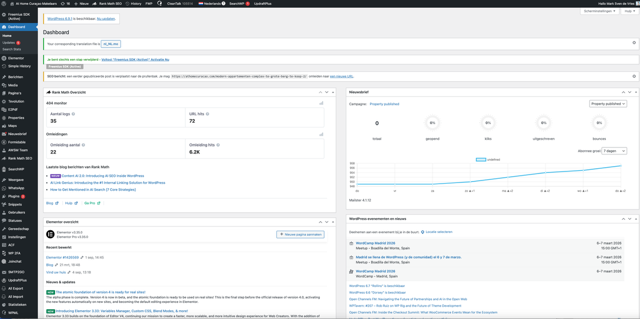
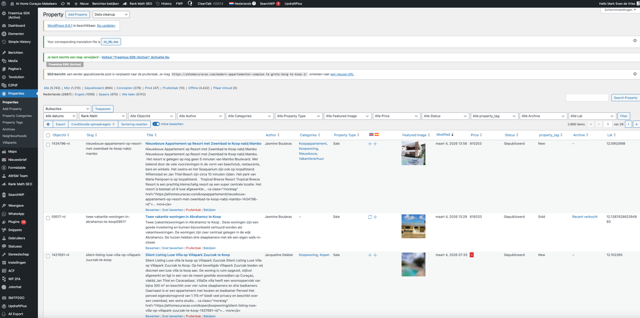

# Stap 2: Dashboard & Backend

Na het inloggen zie je het WordPress Dashboard. Dit is het startpunt voor al je werkzaamheden.

## Het Dashboard

Het dashboard toont een overzicht van:

- Websitestatistieken en bezoekersaantallen
- Recente activiteiten en blogposts
- Snelle links naar veelgebruikte functies

## Het Backend — Property Overzicht

Klik in het linkermenu op **"Properties"** om het overzicht van alle listings te zien.

Hier zie je alle property listings in een tabel met:

| Kolom | Beschrijving |
|-------|-------------|
| **Titel** | Naam van de listing |
| **Thumbnail** | Kleine preview-afbeelding |
| **Status** | Gepubliceerd, Concept, of Prullenbak |
| **Datum** | Publicatiedatum |
| **Categorieën** | Type vastgoed |

## Belangrijke menu-items

| Menu-item | Functie |
|-----------|---------|
| **Properties** | Alle vastgoedlistings beheren |
| **Properties → Add Property** | Nieuwe listing aanmaken |
| **Berichten** | Blogartikelen beheren |
| **Media** | Afbeeldingen en bestanden |
| **Master Slider** | Homepage slider instellen |

## De Frontend bekijken

Klik bovenaan op **"Bezoek site"** om te zien hoe de website eruitziet voor bezoekers:

## Volgende stap

Ga naar [Stap 3: Listing aanmaken](listing-aanmaken.md) om te leren hoe je een nieuwe property listing maakt.
