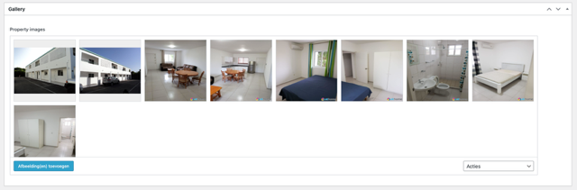
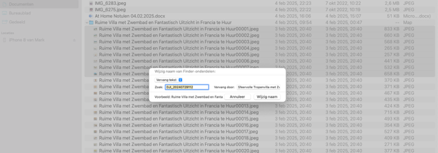
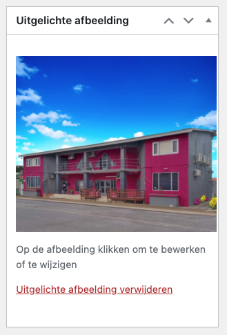

# Stap 5: Foto's & Galerij

Goede foto's zijn essentieel voor het verkopen en verhuren van vastgoed. Hier leer je hoe je foto's uploadt en de galerij beheert.

## Foto's uploaden

1. Scroll in de listing-editor naar het **Gallery** gedeelte (boven de titel)
2. Klik op **"Geüpload naar dit bericht"**
3. Sleep je foto's naar het uploadgebied, of klik op **"Bestanden selecteren"**

## Vereisten voor foto's

| Vereiste | Specificatie |
|----------|-------------|
| **Breedte** | Minimaal **1440 pixels** |
| **Oriëntatie** | Bij voorkeur **liggend** (landscape) |
| **Formaat** | JPG voor foto's, PNG voor logo's |
| **Maximale grootte** | Houd onder 2 MB per foto |

## Bestandsnamen

Gebruik beschrijvende bestandsnamen voor betere SEO:

- ✅ `Luxe-Villa-met-Zwembad-in-Vista-Royal-te-Koop-zwembad-21.jpg`
- ❌ `IMG_1234.jpg`
- ❌ `foto1.png`

## Foto's ordenen

1. **Sleep** de foto's in de gewenste volgorde
2. De **eerste foto** wordt automatisch de uitgelichte afbeelding (profielfoto)
3. Zet de mooiste/meest representatieve foto bovenaan

## Titel en bijschrift toevoegen

Klik op een foto om de details in te vullen:

- **Titel**: Voeg een titel toe met volgnummer (bv. "Villa Vista Royal - Zwembad 1")
- **Bijschrift**: Optioneel (bv. "zwembad", "woonkamer", "slaapkamer")
- **Alt-tekst**: Beschrijving voor SEO en toegankelijkheid

!!! danger "Belangrijk"
    Sluit de media-uploader af met de **X-knop**. Klik **NIET** op "Invoegen in bericht" — dit plaatst de foto in de tekst in plaats van in de galerij.

## Uitgelichte afbeelding

De uitgelichte afbeelding is de hoofdfoto die overal op de website wordt getoond (overzichtspagina's, zoekresultaten, homepage).

1. Scroll naar **"Uitgelichte afbeelding"** in het rechterpaneel
2. Klik op **"Uitgelichte afbeelding instellen"**
3. Kies de beste foto of upload een nieuwe

## Volgende stap

Ga naar [Stap 6: Regio's, Wijken & Locaties](regios-wijken.md) voor de geografische indeling.
