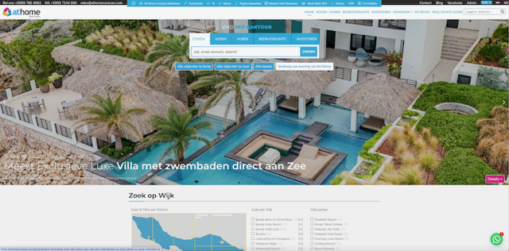

# WordPress Handleiding

Deze handleiding legt stap voor stap uit hoe je de At Home Curaçao website beheert via WordPress. De website [athomecuracao.com](https://athomecuracao.com) is gebouwd met WordPress en een vastgoed-thema voor het beheren van property listings.

## Onderdelen

| Stap | Onderwerp | Beschrijving |
|------|-----------|-------------|
| 1 | [Inloggen](inloggen.md) | Toegang krijgen tot het WordPress dashboard |
| 2 | [Dashboard & Backend](dashboard.md) | Overzicht van het beheergedeelte en property-lijst |
| 3 | [Listing aanmaken](listing-aanmaken.md) | Nieuwe property listing stap voor stap aanmaken |
| 4 | [Beschrijving & SEO](beschrijving-seo.md) | Beschrijving invullen en Rank Math SEO instellen |
| 5 | [Foto's & Galerij](fotos-galerij.md) | Afbeeldingen uploaden en galerij beheren |
| 6 | [Regio's, Wijken & Locaties](regios-wijken.md) | Geografische indeling en kaartlocaties |
| 7 | [Property Tags](tags.md) | SEO-tags toevoegen aan listings |
| 8 | [Slider & Homepage](slider-homepage.md) | Homepage slider en uitgelichte listings instellen |
| 9 | [Blog schrijven](blog.md) | Blogartikelen schrijven en publiceren |
| 10 | [Vertalen (WPML)](vertalen.md) | Listings vertalen naar Engels |
| 11 | [Datum aanpassen](datum-aanpassen.md) | Listing omhoog plaatsen op de website |
| — | [Procedures & Afspraken](procedures.md) | Werkafspraken, relatiecodes en TAG-systeem |

!!! info "Voordat je begint"
    Zorg dat je je inloggegevens hebt ontvangen van je beheerder. Je hebt een gebruikersnaam en wachtwoord nodig.

!!! warning "Belangrijk"
    Sla je werk **regelmatig op als concept** ("Opslaan als Concept") tijdens het aanmaken van een listing. Zo voorkom je dat je werk verloren gaat.
