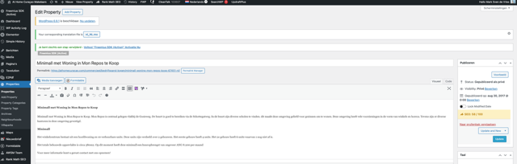
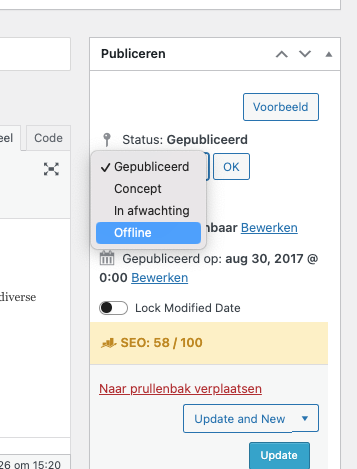
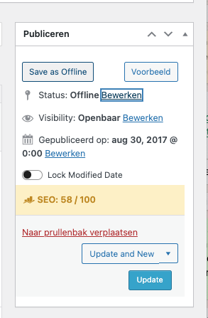
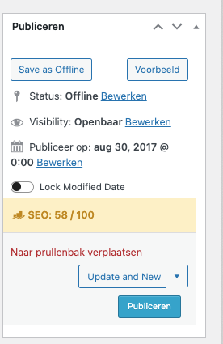

# Stap 3: Listing aanmaken

Dit is de belangrijkste handleiding: het stap-voor-stap aanmaken van een nieuwe property listing op de At Home Curaçao website.

!!! warning "Belangrijk"
    Sla je werk **regelmatig op als concept** door te klikken op "Opslaan als Concept". Zo voorkom je dat je werk verloren gaat.

## Nieuwe listing starten

1. Ga in het linkermenu naar **Properties → Add Property**
2. Je komt nu op het bewerkingsscherm voor een nieuwe listing

## Titel invullen

De titel is cruciaal voor SEO en vindbaarheid. Gebruik dit format:

**Bijvoeglijk naamwoord + Object + Locatie + Status**

Voorbeelden:

- ✅ `Nieuwe Ruime Villa te Koop Vista Royal`
- ✅ `Luxe Appartement met Zwembad te Huur Jan Thiel`
- ❌ `Huis te koop` (te vaag)

Regels voor de titel:

- Gebruik **hoofdletters** aan het begin van elk woord (voor SEO)
- **Geen** speciale tekens zoals é, ü, ñ
- Gebruik **cijfers** waar van toepassing (bv. "3 Slaapkamer")
- Voeg het **objectnummer** niet toe in de titel

## Permalink/URL instellen

Na het invullen van de titel wordt automatisch een permalink (URL) aangemaakt:

- Format: `athomecuracao.com/property/titel-met-streepjes-objectnummer/`
- Alles wordt automatisch **kleine letters** met **streepjes** in plaats van spaties
- Controleer of de URL klopt en pas aan indien nodig

## Property categorieën kiezen

Selecteer het juiste type vastgoed:

| Categorie | Wanneer kiezen |
|-----------|---------------|
| **Koopwoning** | Woning te koop |
| **Huurwoning** | Woning te huur |
| **Vakantieverhuur** | Korte termijn verhuur |
| **BOG** | Bedrijfsonroerend goed |
| **Kavel** | Bouwgrond te koop |
| **Project** | Nieuwbouwproject |

!!! info "Bij verkoop/verhuur"
    Als een pand verkocht of verhuurd is: selecteer **"Verkocht"** of **"Verhuurd"** en verwijder de andere categorieën.

## Metadata invullen

### Basis listing gegevens

| Veld | Wat invullen |
|------|-------------|
| **Titel** | Kopieer de titel nogmaals |
| **Extern ID** | Alleen bij externe/partner listings |
| **Object ID** | Wordt automatisch gegenereerd — **niet wijzigen** |
| **Property Status** | Kies: Nieuw, Exclusief, Tip, Optie, of Onder bod |

### Listing type en prijs

| Veld | Wat invullen |
|------|-------------|
| **Type** | Te Koop / Te Huur / BOG / Vakantie |
| **Prijs** | Altijd in **XCG** (geen komma's, punten of valutatekens) |
| **Prijs per** | Nacht, maand of jaar (bij huur) |
| **Vaste prijs EUR** | Optioneel, alleen als eigenaar dit verzoekt |
| **Vaste prijs USD** | Optioneel, alleen als eigenaar dit verzoekt |

!!! danger "Let op bij prijs"
    Voer de prijs in als een getal zonder opmaak. Dus `500000` en niet `500.000` of `XCG 500,000`.

### Bemiddelingskosten

- **Bemiddelingskosten**: Bij verhuur altijd = verhuurder
- **Huurkosten incl.**: Vul in welke kosten zijn inbegrepen

### Property details

| Veld | Wat invullen |
|------|-------------|
| **Slaapkamers** | Aantal slaapkamers |
| **Badkamers** | Aantal badkamers |
| **Woonoppervlakte** | In m² |
| **Grondoppervlakte** | In m² |
| **Adres** | Volledig adres, of wijk als adres onbekend |

### Kaartlocatie instellen

1. Scroll naar het kaartveld
2. Klik op de kaart om de locatie handmatig in te stellen
3. Verschuif de pin naar de juiste positie

## Kenmerken (Features)

Vink de relevante kenmerken aan die bij het pand horen, zoals:

- Zwembad
- Airconditioning
- Garage
- Tuin
- Zeezicht
- Gemeubileerd

## Property categorieën (hoofdgroepen)

Selecteer de juiste hoofdgroepen:

| Hoofdgroep | Wanneer |
|------------|---------|
| **Kopen** | Bij koopwoningen |
| **Huren** | Bij huurwoningen |
| **Commercieel** | Bij BOG |
| **Vastgoed Investering** | Bij investeringspanden |
| **Studentenwoning** | Bij studentenhuisvesting |
| **Vakantieverhuur** | Bij vakantie-woningen |

Selecteer ook de relevante **subgroepen** (meerdere mogelijk).

!!! tip "Featured"
    Vink **"Featured"** alleen aan als het pand op de homepage moet verschijnen in de uitgelichte lijst.

## Villaparken

- Selecteer het juiste villapark als het pand in een villapark ligt
- Nieuw villapark nodig? Je mag deze aanmaken, maar **meld het bij de beheerder** voor de Engelse vertaling

## Opslaan en publiceren

### Het bewerkscherm

Het bewerkscherm bevat links de editor met de beschrijvingstekst en rechts het **Publiceren-paneel** met de listing-status.

### Publicatiestatus kiezen

In het **Publiceren-paneel** rechtsboven kies je de status van de listing:

| Status | Wanneer gebruiken |
|--------|-------------------|
| **Gepubliceerd** | Listing is live op de website |
| **Concept** | Listing is nog niet klaar (niet zichtbaar) |
| **In afwachting** | Wacht op goedkeuring van beheerder |
| **Offline** | Listing tijdelijk offline halen |

### Listing offline zetten

Om een listing offline te zetten:

1. Klik op **"Bewerken"** naast Status
2. Kies **"Offline"**
3. Klik op **"OK"**
4. Klik op **"Update"**

De listing is nu niet meer zichtbaar op de website maar blijft bewaard in het systeem.

### Listing opnieuw publiceren

Om een offline listing opnieuw te publiceren:

1. Open de listing
2. Klik op de blauwe knop **"Publiceren"**
3. De listing is weer live op de website

### Publiceren workflow

1. Klik op **"Voorbeeld"** om te controleren hoe de listing eruitziet
2. Tevreden? Klik op **"Publiceren"**
3. Niet klaar? Klik op **"Opslaan als Concept"**
4. Na publicatie: klik op **"Wijzigingen bekijken"** om te controleren

!!! warning "SEO-score"
    In het Publiceren-paneel zie je ook de **SEO-score** (bijv. 58/100). Streef naar een score van minimaal **70/100**. Zie [Stap 4: Beschrijving & SEO](beschrijving-seo.md) voor tips.

!!! danger "Lock Modified Date"
    De **"Lock Modified Date"** toggle houdt de publicatiedatum vast. Gebruik dit **niet** als je wilt dat de listing omhoog komt in de lijst. Zie [Stap 11: Datum aanpassen](datum-aanpassen.md).

## Volgende stap

Ga naar [Stap 4: Beschrijving & SEO](beschrijving-seo.md) voor het invullen van de beschrijvingstekst en SEO-instellingen.
