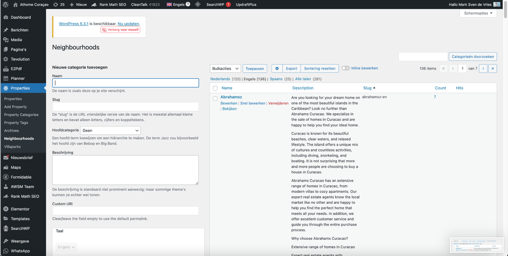
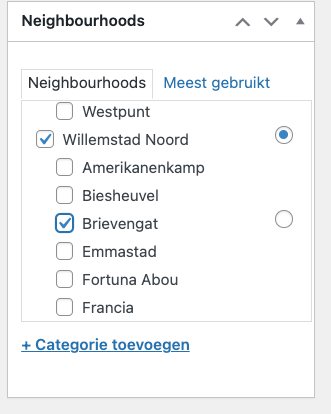
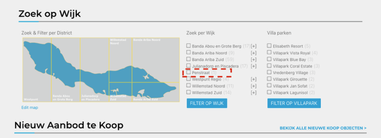
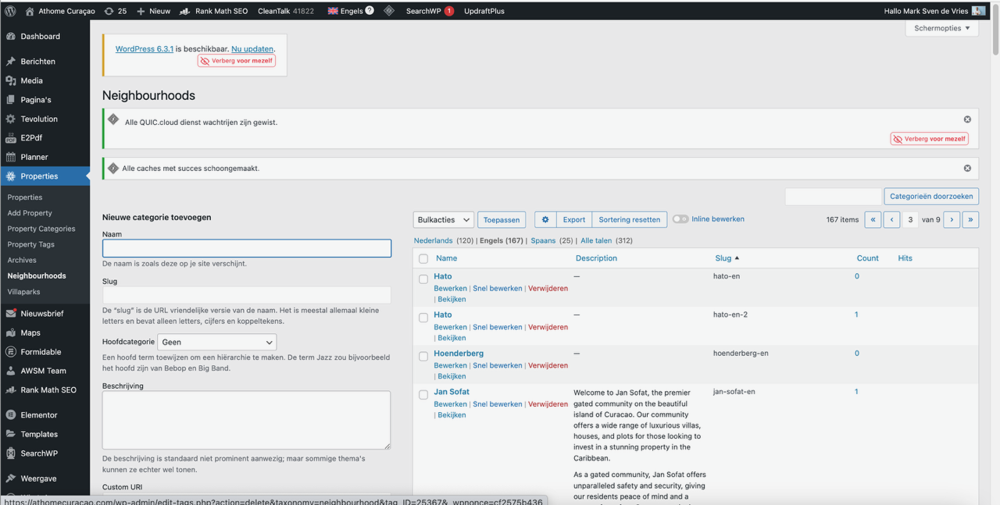
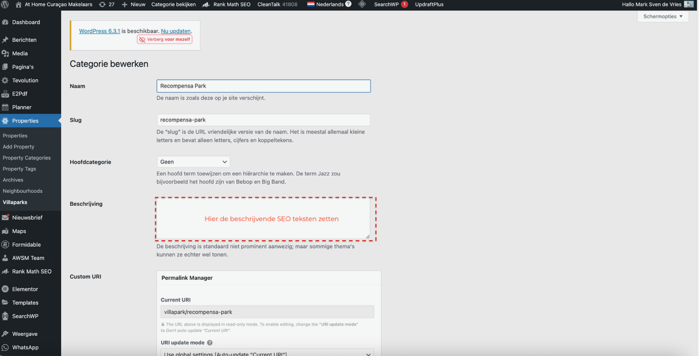
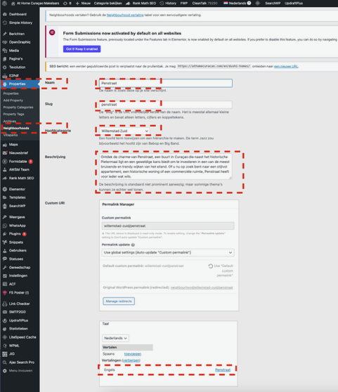

# Stap 6: Regio's, Wijken & Locaties

Hier leer je hoe je de juiste regio, wijk en locatie instelt voor een listing.

## Regio kiezen

Curaçao is verdeeld in **7 regio's**. Selecteer maximaal **1 regio** per listing.

## Wijk/Plaats kiezen

Na het kiezen van de regio kun je één of meerdere **wijken** selecteren.

!!! danger "Geen nieuwe wijken aanmaken"
    Maak **nooit** zelf nieuwe wijken aan. Dit mag alleen de systeembeheerder doen, omdat wijken ook vertaald moeten worden naar het Engels. Meld een ontbrekende wijk bij je beheerder.

## Locatie op de kaart

### Kaartlocatie instellen

1. Scroll naar het **kaart**-gedeelte in de listing
2. Voer het adres in, of klik direct op de kaart
3. Verschuif de pin naar de exacte locatie van het pand

De kaart toont de wijken van Curaçao met filtermogelijkheden:

- **Zoek op Wijk**: Bezoekers kunnen filteren per district
- **Filter op Villapark**: Bezoekers kunnen filteren per villapark

## Wijken en villaparken beheren

### Beschrijving toevoegen

Elke wijk en elk villapark kan een beschrijving krijgen die bezoekers te zien krijgen:

### Wijk onder regio hangen

Nieuwe wijken moeten gekoppeld worden aan de juiste regio en vertaald worden:

## Alle wijken op Curaçao

Onderstaande lijst bevat alle wijken die in het systeem staan. Gebruik **alleen** wijken uit deze lijst.

Abrahamsz, Amerikanenkamp, Banda Abou, Barber, Biesheuvel, Blue Bay, Boca Gentil, Boca Sami, Bonam, Bottelier, Brakkeput, Brievengat, Buena Vista, Caracasbaaiweg, Cas Abou, Cas Cora, Cas Grandi, Cerrito, Coral Estate, Curasol, Damacor, Damasco, Dominquito, Emmastad, Fontein, Fortuna Ariba, Francia, Girouette, Grote Berg, Hanenberg, Hato, Jan Sofat, Jan Thiel, Janwe, Jongbloed, Julianadorp, Katoentuin, Koraal Partier, Koraal Specht, Kwartje, Lagun, Lagunisol, Mahaai, Mahuma, Mambo, Marbella, Marchena, Marie Pampoen, Matancia, Mon Repos, Montana, Muizenberg, Otrobanda, Pietermaai, Piscadera, Pos Cabai, Punda, Rooi Catochi, Rooi Santu, Royal Palm Resort, Rust en Vrede, Sabana Craz, Salina, San Sebastiaan, Santa Barbara, Santa Catharina, Santa Maria, Santa Rosa, Scharloo, Schelpwijk, Scherpenheuvel, Seaquarium, Semi Kok, Seru Boka, Seru Coral, Seru Lora, Sint Michiels, Sint Willibrordus, Sorsaka, Soto, Spaanse Water, Steenrijk, Suffisant, Sun Valley, Sunset Heights, Tera Kora, Toni Kunchi, Van Engelen, Veeris, Vista Montana, Vista Royal, Vredenberg, Westpunt, Willemstad, Zapateer, Zeelandia, Zegu, Zuurzak.

### Villaparken

- Villapark Blue Bay
- Villapark Boca Gentil
- Villapark Coral Estate
- Jalousi Residence
- Villapark Jan Sofat
- La Maya Resort
- Villapark Seru Coral
- Villapark Royal Gardens
- Villapark Vredenberg
- Villawijk Vista Royal
- Villapark Zuurzak
- Marbella Estate

## Volgende stap

Ga naar [Stap 7: Property Tags](tags.md) voor het toevoegen van SEO-tags.
