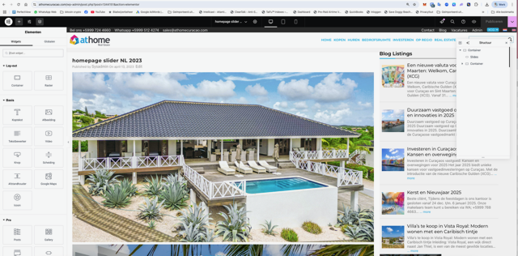
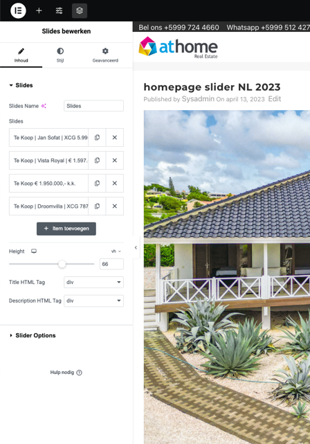
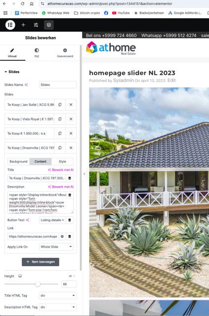

# Stap 8: Slider & Homepage

De homepage van athomecuracao.com toont een grote afbeeldingsslider met uitgelichte listings. Hier leer je hoe je deze instelt.

## De Homepage Slider

De slider is het eerste wat bezoekers zien op de homepage:

## Slider instellen

### Stap 1: Master Slider openen

1. Ga in het linkermenu naar **"Master Slider"**
2. Klik op de slider die je wilt bewerken

### Stap 2: Slides bewerken

1. Klik op de slide die je wilt aanpassen
2. Upload een nieuwe afbeelding of wijzig de bestaande
3. Pas de tekst en link aan

### Vereisten voor slider-afbeeldingen

| Vereiste | Specificatie |
|----------|-------------|
| **Breedte** | Minimaal 1920 pixels |
| **Oriëntatie** | Altijd liggend (landscape) |
| **Kwaliteit** | Hoge resolutie, scherpe foto |
| **Onderwerp** | Aantrekkelijke vastgoedfoto (exterieur met zwembad, zeezicht, etc.) |

## Uitgelichte listings op homepage

Om een listing op de homepage te tonen in de "Uitgelicht" sectie:

1. Open de betreffende listing in WordPress
2. Vink bij Property categorieën **"Featured"** aan
3. Sla de listing op

!!! warning "Let op"
    Niet te veel listings als "Featured" markeren — dit houdt de homepage overzichtelijk.

## Volgende stap

Ga naar [Stap 9: Blog schrijven](blog.md) om te leren hoe je blogartikelen maakt.
