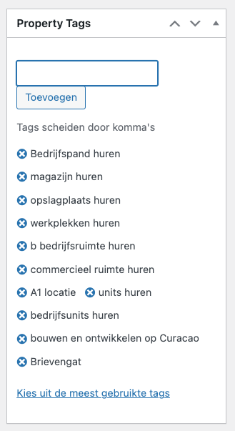

# Stap 7: Property Tags

Tags helpen bij de vindbaarheid van listings in Google en op de website zelf. Hier leer je welke tags je moet toevoegen.

## Tags toevoegen

1. Scroll in de listing-editor naar het **"Property Tags"** paneel (rechterzijde)
2. Typ een tag in het invoerveld
3. Scheid meerdere tags met een **komma**
4. Klik op **"Toevoegen"**

!!! tip "Tip"
    Klik op **"Kies uit de meest gebruikte tags"** voor een overzicht van bestaande tags.

## Welke tags gebruiken?

Kies tags op basis van het type listing. Hieronder de belangrijkste categorieën:

### Kopen — Huis/Villa

- woning kopen Curacao
- villa kopen Curacao
- luxe villa kopen
- vrijstaande villa kopen
- huis te koop Curacao
- koopwoning Curacao
- investeren in vastgoed Curacao
- woning met tuin en zwembad kopen
- makelaar kopen Curacao
- TOP makelaars Curacao

### Kopen — Appartement

- appartement te koop Curacao
- koopappartement Curacao
- appartement met goede huuropbrengst
- makelaar appartement Curacao

### Huren

- huurwoningen op Curacao
- huis huren Curacao lange termijn
- appartementen huren op Curacao
- woning te huur op Curacao
- huis te huur Curacao gemeubileerd
- makelaar Curacao huur

### Vakantieverhuur

- vakantiewoning Curacao
- korte termijn verhuur Curacao
- holiday rental Curacao
- ruime vakantie villa huren
- vakantie woning met zwembad huren

### BOG (Bedrijfsonroerend goed)

- BOG koop / BOG huur
- bedrijfspand kopen/huren
- magazijn / opslagplaats
- werkplekken / bedrijfsruimte
- commercieel ruimte
- A1 locatie

### Kavels

- kavel Curacao
- bouwkavel te koop
- grond te koop Curacao
- bouwen op Curacao

### Nieuwbouw

- nieuwbouw Curacao
- nieuwbouwproject
- nieuwbouw villa / appartement
- bouwen en ontwikkelen op Curacao

### Meta tags (social media)

Voeg ook relevante hashtags toe:
`#CuraçaoVastgoed`, `#athomecuracao`, `#VastgoedCuraçao`, `#MakelaarCuraçao`, `#DroomHuis`, `#VakantiehuizenCuraçao`

!!! info "Locatie-specifieke tags"
    Voeg altijd de **wijknaam** toe aan je tags. Bijvoorbeeld: "villa kopen Vista Royal", "huis huren Jan Thiel", "appartement Pietermaai".

## Volgende stap

Ga naar [Stap 8: Slider & Homepage](slider-homepage.md) voor het instellen van de homepage slider.
