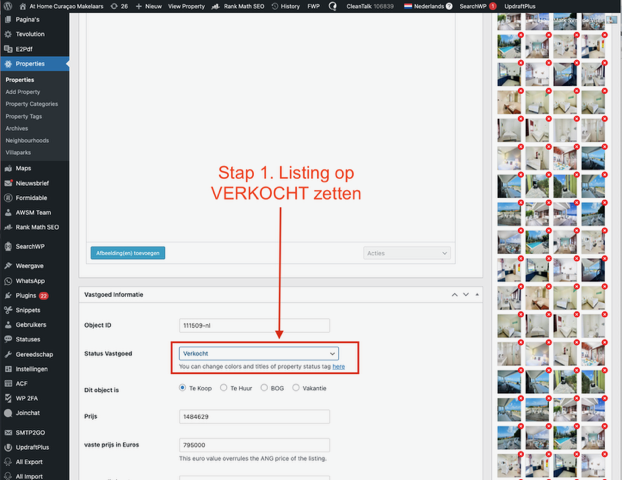
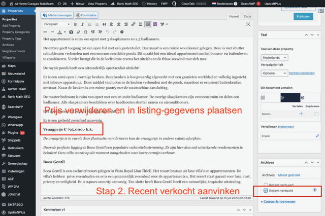
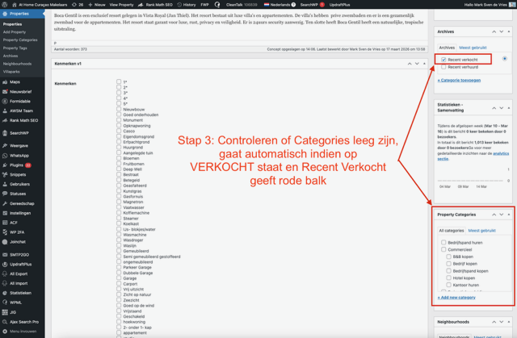
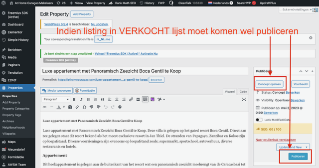
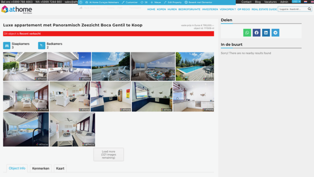

# Listing op Verkocht of Verhuurd zetten

Wanneer een woning is verkocht of verhuurd, moet de listing in WordPress worden bijgewerkt zodat deze verschijnt in de "Recent Verkocht" of "Recent Verhuurd" lijst op de website.

**Resultaat:**

- De listing verschijnt op [athomecuracao.com/archive/verkocht/](https://athomecuracao.com/archive/verkocht/) of [athomecuracao.com/archive/verhuurd/](https://athomecuracao.com/archive/verhuurd/)
- De listing toont een **rode balk** bovenaan met de tekst "Dit object is Recent verkocht"
- De listing is niet meer zichtbaar in de reguliere zoekresultaten

---

## Stap 1: Status Vastgoed wijzigen

1. Open de listing in WordPress (via **Properties** in het linkermenu)
2. Scroll naar het blok **Vastgoed Informatie**
3. Wijzig het veld **Status Vastgoed** naar **"Verkocht"** (of **"Verhuurd"**)

---

## Stap 2: Prijs verwijderen en categorie aanvinken

1. **Verwijder de prijs** uit het prijsveld (maak het veld leeg)
2. Scroll naar **Property Categories** (rechts in het scherm)
3. Vink **"Recent verkocht"** aan (of **"Recent verhuurd"** bij verhuur)

---

## Stap 3: Property Categories controleren

Controleer dat de **Property Categories** correct zijn ingesteld:

- De oude categorieën (Koopwoning, Huurwoning, etc.) mogen **leeg** zijn
- Wanneer de status op "Verkocht" staat, wordt de listing automatisch aan de verkocht-categorie gekoppeld
- De rode balk verschijnt automatisch op de frontend

---

## Stap 4: Publiceren

De listing moet **gepubliceerd** blijven om in de Verkocht/Verhuurd lijst te verschijnen.

1. Controleer dat de status op **"Gepubliceerd"** staat (niet op Concept of Offline)
2. Klik op **"Bijwerken"** (of **"Publiceren"** als de listing nog niet gepubliceerd was)

!!! warning "Belangrijk"
    Een listing die op "Offline" of "Concept" staat, verschijnt **niet** in de Recent Verkocht/Verhuurd lijst. De listing moet gepubliceerd blijven.

---

## Resultaat op de website

Na het bijwerken verschijnt de listing met een **rode balk** bovenaan:

De rode balk toont: **"Dit object is Recent verkocht"** (of "Recent verhuurd").

---

## Recent Verkocht & Verhuurd pagina's

De verkochte en verhuurde listings zijn te vinden op:

| Pagina | URL |
|--------|-----|
| **Recent Verkocht** | [athomecuracao.com/archive/verkocht/](https://athomecuracao.com/archive/verkocht/) |
| **Recent Verhuurd** | [athomecuracao.com/archive/verhuurd/](https://athomecuracao.com/archive/verhuurd/) |

Deze pagina's worden automatisch bijgewerkt zodra een listing de juiste status heeft.

---

## Samenvatting stappen

| Stap | Actie |
|------|-------|
| 1 | **Status Vastgoed** wijzigen naar "Verkocht" of "Verhuurd" |
| 2 | **Prijs verwijderen** en **"Recent verkocht/verhuurd"** aanvinken bij Property Categories |
| 3 | Controleer dat oude categorieën leeg zijn |
| 4 | **Publiceren** / **Bijwerken** — listing moet gepubliceerd blijven |

!!! tip "Verhuurd werkt hetzelfde"
    De procedure voor "Verhuurd" is identiek, maar dan kies je "Verhuurd" als status en vink je "Recent verhuurd" aan bij Property Categories. De listing verschijnt dan op [athomecuracao.com/archive/verhuurd/](https://athomecuracao.com/archive/verhuurd/).
