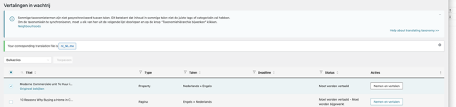
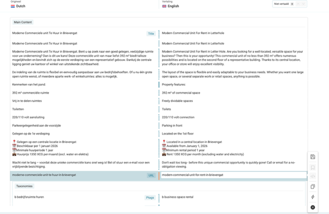
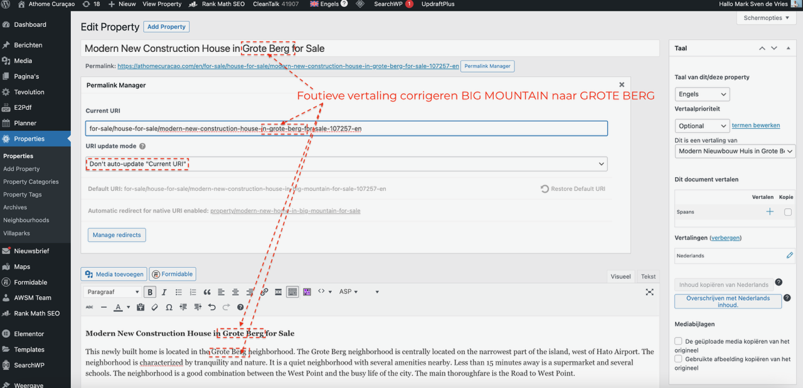
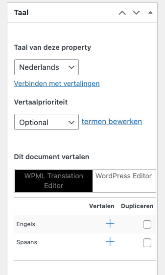

# Stap 10: Vertalen (WPML)

De At Home Curaçao website is tweetalig (Nederlands en Engels). Hier leer je hoe je listings en content vertaalt met de WPML-vertaaltool.

## Vertaling starten

### Automatisch vertalen

Bovenaan de vertaalpagina staat de knop **"Automatisch vertalen"**. Klik hierop om de listing automatisch te laten vertalen. Controleer onderaan de pagina of de voortgang op **100%** staat voordat je op **"Accepteren en opslaan"** klikt.

!!! warning "Belangrijk"
    Druk pas op **"Accepteren en opslaan"** wanneer de vertaalvoortgang onderaan **100%** aangeeft. Anders worden niet alle velden correct opgeslagen.

### Opdracht aannemen

1. Open de listing of het bericht dat vertaald moet worden
2. Klik op het **WPML vertaalicoon** (vlaggetje) naast de taal
3. De vertaalopdracht verschijnt — klik op **"Aannemen"**

## Vertaling uitvoeren

### Permalink vertalen

1. Vertaal de **permalink/URL** naar het Engels
2. Gebruik streepjes in plaats van spaties
3. Houd de URL kort en beschrijvend

!!! danger "Let op: for-hire → for-rent"
    WPML stelt bij huurwoningen vaak **"for-hire"** voor in de permalink. Dit is incorrect Engels. Wijzig dit altijd handmatig naar **"for-rent"**.

    - Fout: `luxurious-villa-**for-hire**-jan-thiel`
    - Goed: `luxurious-villa-**for-rent**-jan-thiel`

### Content vertalen

1. Vertaal de **titel** naar het Engels
2. Vertaal de **beschrijvingstekst**
3. Vertaal de **Property Expert tekst**
4. Vertaal de **meta beschrijving** (SEO)

!!! tip "Tip"
    Je kunt de Engelse vertaling aanpassen na de automatische vertaling. Controleer altijd of de tekst natuurlijk klinkt.

### k.k. vertalen naar c.o.b.

In het Nederlands gebruiken we **k.k.** (kosten koper). In de Engelse vertaling moet dit worden: **c.o.b.** (costs on behalf of buyer).

| Nederlands | Engels |
|------------|--------|
| k.k. (kosten koper) | c.o.b. (costs on behalf of buyer) |
| v.o.n. (vrij op naam) | free of charge to the buyer |

!!! warning "Controleer altijd"
    De automatische vertaling vertaalt k.k. vaak niet correct. Pas dit handmatig aan naar **c.o.b.**

### Engelse vertaling naar tekst

## Checklist vertaling

Controleer na het vertalen:

- [ ] Titel is vertaald
- [ ] Permalink is vertaald (Engelse URL) — **for-rent** i.p.v. for-hire
- [ ] **k.k.** is vertaald naar **c.o.b.**
- [ ] Beschrijvingstekst is vertaald
- [ ] Meta beschrijving (SEO) is vertaald
- [ ] Vertaalvoortgang staat op **100%**
- [ ] Foto's hoeven **niet** opnieuw geüpload te worden (deze worden automatisch overgenomen)

!!! warning "Let op"
    Wijken en regio's worden door de systeembeheerder vertaald. Maak **nooit** zelf nieuwe wijken aan — deze moeten eerst vertaald worden.

## Volgende stap

Ga naar [Stap 11: Datum aanpassen](datum-aanpassen.md) om te leren hoe je een listing omhoog plaatst.
