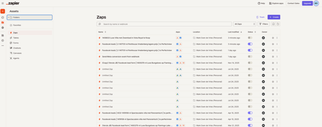
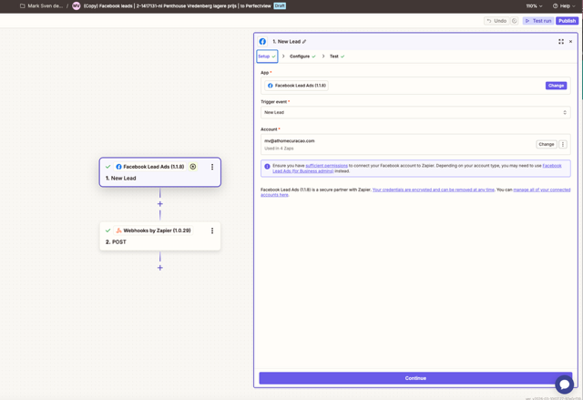
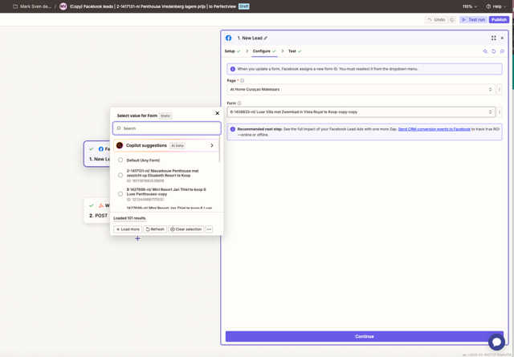

# Zapier Automatisering

At Home Curaçao gebruikt Zapier om automatische workflows te maken tussen verschillende tools. De belangrijkste automatisering is het doorsturen van **Facebook Lead Ads** naar Perfectview en e-mail.

!!! info "Toegang"
    Je hebt een Zapier-account nodig met toegang tot de At Home Curaçao workspace. Vraag de beheerder om toegang.

## Wat is Zapier?

Zapier verbindt verschillende apps en tools automatisch met elkaar. Een automatisering in Zapier heet een **"Zap"**. Elke Zap bestaat uit:

1. **Trigger** — het startpunt (bijv. "nieuwe lead in Facebook")
2. **Actie** — wat er moet gebeuren (bijv. "stuur e-mail" of "maak contact in Perfectview")

## Zaps overzicht

Na het inloggen op [zapier.com](https://zapier.com) zie je het overzicht van alle actieve Zaps.

Het overzicht toont per Zap:

| Kolom | Betekenis |
|-------|-----------|
| **Naam** | Beschrijving van de automatisering |
| **Status** | Aan (groen) of uit (grijs) |
| **Trigger** | De app die de Zap start |
| **Actie** | Wat er wordt uitgevoerd |
| **Laatste run** | Wanneer de Zap voor het laatst is uitgevoerd |

## Facebook Lead Ads → Webhook

De belangrijkste Zap koppelt Facebook Lead Ads aan het At Home systeem.

### Stap 1: Trigger — Nieuwe lead

De trigger is ingesteld op **"New Lead"** van Facebook Lead Ads:

1. De Zap controleert continu of er nieuwe leads binnenkomen via Facebook advertenties
2. Bij een nieuwe lead wordt de Zap automatisch geactiveerd
3. De leadgegevens (naam, e-mail, telefoon, interesse) worden opgehaald

### Stap 2: Actie — Webhook (POST)

De actie stuurt de leadgegevens door via een **Webhook (POST)**:

1. Selecteer het juiste **Lead Form** uit Facebook
2. De velden worden automatisch gemapt (naam → naam, e-mail → e-mail, etc.)
3. De gegevens worden doorgestuurd naar het At Home systeem

!!! warning "Niet aanpassen"
    Wijzig de Zapier-configuratie niet zonder overleg met de beheerder. Een verkeerde instelling kan ervoor zorgen dat leads niet meer binnenkomen.

## Zap beheren

### Aan- en uitzetten

- Klik op de **toggle** naast een Zap om deze aan of uit te zetten
- Een uitgeschakelde Zap verwerkt geen nieuwe triggers

### Testen

- Klik op **"Run"** om een Zap handmatig te testen
- Controleer of de testgegevens correct doorkomen

### Nieuwe Zap aanmaken

1. Klik op **"Create"** rechtsboven
2. Kies een trigger-app (bijv. Facebook Lead Ads)
3. Configureer de trigger
4. Kies een actie-app (bijv. Webhook, Gmail, Perfectview)
5. Configureer de actie
6. Test de Zap
7. Zet de Zap aan

!!! info "Alleen voor beheerders"
    Het aanmaken van nieuwe Zaps is voorbehouden aan de beheerder. Meld nieuwe automatiseringswensen bij de beheerder.
